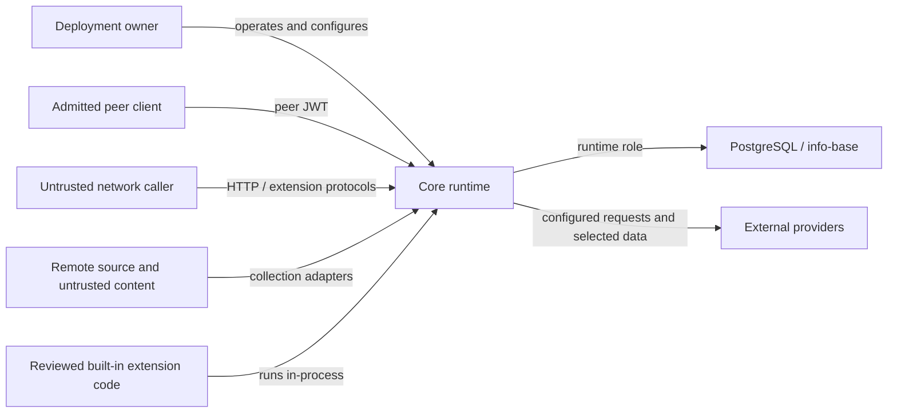

# Core Security Model

## Purpose

This document defines the repository-local security model for `core-py`. It helps humans
and agents decide whether an observation is a vulnerability, an ordinary bug, a hardening
opportunity, an operational risk, or an accepted risk.

Read it before making a security-sensitive design or triage claim. It is not a list of
controls to maximize. A proposed control is justified only when it protects an identified
asset from a plausible actor crossing an intended trust boundary at a proportionate cost.

External vulnerability reporting is owned by the root [Security Policy](../../SECURITY.md).
Exact authentication, database, and runtime behavior remains owned by code, tests, CI, and
the linked deployment contracts.

## Scope

The model covers the FastAPI runtime, the executable PostgreSQL contract, built-in
extensions, source collection, resolver/storage access, background jobs, and the artifact
and deployment surfaces owned by this repository.

It does not define browser rendering safety, native-client storage, organization-wide
account security, or a product-wide disclosure policy for other InKCre repositories.
Cross-repository security assumptions belong in the shared Hub when they become stable
product contracts.

## System And Trust Boundaries

The arrows describe boundaries, not a promise that every deployment exposes every path.
Transport termination, host isolation, backups, and provider access are supplied by the
selected deployment environment and must be assessed with its runtime documentation.

## Actors And Authority

| Actor | Security posture |
| --- | --- |
| Deployment owner | Trusted administrator of one single-user deployment. Can configure the runtime, inspect its database and backups, and replace the artifact. |
| Admitted peer client | Inside the deployment trust domain after satisfying the executable peer contract. Current core surfaces do not provide per-user or per-tenant isolation between admitted peers. |
| Untrusted network caller | Has no core authority until admitted by the relevant protocol. Public health/probe routes grant only their documented observations. |
| Extension protocol client | Untrusted until the extension's own admission mechanism succeeds. Its authority is limited by that protocol's intended surface, not by core peer identity. |
| Remote source and collected content | Untrusted data. A configured source may supply malformed, adversarial, stale, or misleading content. Collection does not make content executable or trustworthy. |
| Built-in extension code | Trusted artifact code reviewed and shipped with core. It runs in-process and is not a sandbox or a tenant boundary. Adding third-party extension code is equivalent to adding application code. |
| External provider | Outside the deployment boundary. It receives only requests and data deliberately sent by configured code, subject to the provider's own policy and credentials. |

## Protected Assets

- confidentiality and integrity of info-base blocks, relations, raw attachments, and their
  derived resolver output;
- credentials and signing material used to admit peers, extension clients, database roles,
  sources, and external providers;
- the deployment owner's control over collection, organization, retrieval, configuration,
  and deletion;
- artifact, migration, and dependency integrity;
- availability where an untrusted actor can cause meaningful denial, resource exhaustion,
  or external cost without already holding equivalent deployment authority.

## Security Boundaries And Invariants

### Admission

Core API and PostgREST admission are one peer trust boundary. Their exact JWT claims,
database roles, and denial behavior are owned by the [Executable Database
Contract](../40-deployment/database-contract.md) and executable tests.

An extension may expose public, peer-authenticated, or self-authenticated routes. Public
routes must reveal only facts intentionally public for that protocol. Self-authenticated
routes own their credential and authority semantics; successful extension authentication
does not silently grant unrelated core authority.

CORS, obscurity, route naming, and possession of a client identifier are not authorization
boundaries.

### Persistence And Credentials

PostgreSQL is inside the deployment trust boundary when accessed by the runtime and
admitted peers. Persisting a credential in an access-controlled configuration row is not,
by itself, a boundary violation. The relevant requirements are that it is not exposed to
unauthorized callers, logs, public artifacts, or unrelated protocols, and that its lifetime
and replacement behavior match the product need.

Encryption at rest, an external secret manager, or non-persistence may be valuable
hardening when the deployment adds an untrusted database operator, independently exposed
backups, multiple users, regulatory duties, or another concrete boundary. Those controls
are not automatic requirements in the current single-owner model.

### Data And Code

Collected text, metadata, media, filenames, provider responses, resolver input, and LLM
input are data controlled partly or wholly by external parties. They must not become code,
filesystem paths, SQL, templates, privileged commands, or authorization decisions without
an explicit validating boundary.

Storing or resolving adversarial content is not itself a vulnerability. Executing it,
letting it escape its intended data context, or allowing it to drive privileged behavior
may be one. Downstream clients remain responsible for safe rendering and interaction in
their own repositories.

### Extensions And Supply Chain

Built-in extensions share the runtime's process and database authority. The extension
registry is an organization mechanism, not a security sandbox. Runtime installation of
unreviewed code is outside the current product contract; reviewed artifact construction,
locked dependencies, migration integrity, and CI checks are the relevant supply-chain
boundaries.

### Runtime And Operations

The deployment owner, host administrator, migration owner, and anyone able to replace the
running artifact are already inside the highest local authority boundary. Protecting a
deployment from its own fully privileged operator is not a current goal.

Public health surfaces must not disclose credentials, provider exceptions, or database
URLs. Runtime ownership, readiness, reset guards, credential locations, and cleanup are
owned by the [Deployment documentation](../40-deployment/README.md).

## What Usually Constitutes A Vulnerability

Examples include a plausible path for an actor to:

- read, create, change, or delete protected data without the authority intended by the
  relevant protocol;
- forge or bypass admission and gain materially greater authority;
- cause attacker-controlled data to execute code or privileged commands;
- expose credentials or private content across an intended boundary through responses,
  logs, artifacts, caches, or providers;
- compromise artifact, migration, or dependency integrity in a way that reaches users;
- cause material denial of service or external cost from an otherwise untrusted position.

A report needs both security harm and an attack path. A surprising behavior, best-practice
deviation, missing defense-in-depth layer, or hypothetical consequence without a boundary
crossing is not enough on its own.

## Non-Boundaries And Common False Positives

The following are not vulnerabilities under the current model unless additional evidence
introduces a different actor or boundary:

- the deployment owner reading or changing its own database, configuration, backups, or
  process memory;
- one admitted peer exercising capability intentionally shared with admitted peers;
- trusted built-in extension code reaching runtime resources available to application
  code;
- a credential being persisted inside the access-controlled deployment boundary;
- lack of encryption at rest or an extra authentication layer without a demonstrated
  unauthorized reader or caller;
- malformed or hostile collected content being stored as inert data;
- an architectural hardening opportunity described without an exploit path or user harm;
- behavior that requires prior host-administrator, migration-owner, or artifact-replacement
  authority.

These observations can still justify maintainability, privacy, reliability, or
defense-in-depth work. Classifying them accurately prevents that work from borrowing false
urgency from the word "vulnerability."

## Proportionality Method

Before requiring a security control or classifying a report, write down:

1. **Actor and capability**: who acts, and what authority do they already possess?
2. **Asset and harm**: what protected interest changes, leaks, executes, or becomes
   unavailable?
3. **Boundary**: what intended separation is crossed?
4. **Attack path**: what reproducible or technically credible steps connect actor to harm?
5. **Existing controls**: which code, tests, deployment controls, or operational assumptions
   already reduce the risk?
6. **Control cost**: what complexity, failure mode, user friction, or operational burden
   would the proposed control introduce?
7. **Classification**: vulnerability, ordinary bug, hardening, operational risk, or accepted
   risk?

Prefer the least complex control that materially changes the identified risk. Re-evaluate
the classification when deployment assumptions change; do not preserve an old answer by
turning it into a timeless slogan.

## Worked Boundary Check: Extension PAT Persistence

The Memos PAT admits a protocol client to a deployment-scoped extension. The current
deployment is single-owner, extension configuration is already persisted in PostgreSQL,
and database/runtime operators are trusted administrators. The intended boundary is
between an unauthenticated protocol caller and the Memos backend, not between the owner and
its own database.

Therefore, storing the PAT in validated extension configuration is acceptable in this
model. Required controls concern request-time comparison, replacement/revocation,
authorization of config access, and avoiding public/log/artifact disclosure. Forcing the
PAT into a separate non-persistent channel would add configuration and lifecycle complexity
without protecting it from a different current actor.

That conclusion must change if the product introduces untrusted database readers,
separately exposed backups, multi-user isolation, delegated extension administration, or a
compliance requirement. The method is stable; the result is conditional on the model.

## Review And Ownership

- Security reporting and disclosure: [Security Policy](../../SECURITY.md)
- Internal graph/source/resolver authority: [Business Pipeline And
  Authority](business-pipeline-and-authority.md)
- Database roles, JWT, and protocol admission: [Executable Database
  Contract](../40-deployment/database-contract.md)
- Runtime, health, and operational ownership: [Deployment
  documentation](../40-deployment/README.md)
- Enforced dependency admission: [repository CI](../../.github/workflows/ci.yml)

Update this model when an actor, asset, deployment assumption, or trust boundary changes.
Do not duplicate implementation details here merely because they are security-relevant.
