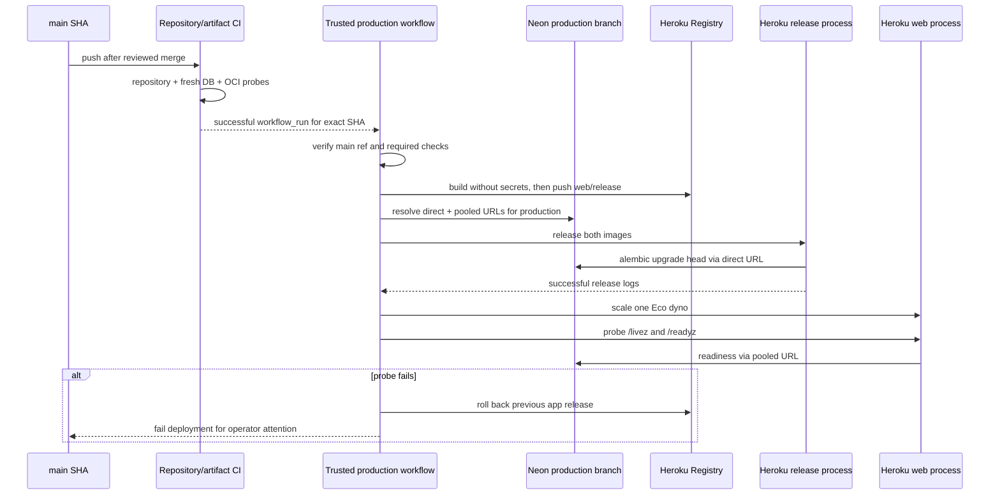

# Execution 07 — Main-To-Production Delivery

## MVT Core

- Objective & Hypothesis: turn a green `main` commit into one immutable OCI release on a
  new Heroku production app backed by a canonical Neon `production` branch copied from the
  durable checkpoint, while preserving the legacy staging runtime and both recovery paths.
  The hypothesis is that a trusted post-CI workflow, separate pooled/runtime and
  direct/migration connections, and an application-only rollback make production delivery
  repeatable without making Heroku the platform contract.
- Guardrails Touched: `main` is the only production source; the exact CI-proven SHA is
  built without deployment secrets; one release process applies checked-in migrations;
  production data comes from the checkpoint rather than seed; no automatic database
  downgrade; no force-push/reset of divergent Git history; no custom-domain cutover in this
  execution.
- Verification: prove the production branch against the recovered manifest and canonical
  migration head, require `main` plus green repository/artifact checks, deploy both process
  images, inspect release logs, require liveness/readiness and exact head, then demonstrate
  application-release rollback without changing the database head.

## Classification And Mode

- Constraint:
  - Git `main` is the production policy branch;
  - Heroku remains the current compute provider but must be replaceable;
  - Neon remains the database provider;
  - checked-in extensions are the immutable built-in image profile.
- Reality:
  - `main` has seven unique Cloudflare experiment/revert commits but its tree equals the
    `main`/`develop` merge-base;
  - `develop` has 131 unique commits before this delivery work;
  - GitHub `production` exists without secrets, variables, branch policy, or reviewers;
  - no Heroku production app and no Neon `production` branch exist;
  - the only data-bearing runtime is legacy `inkcre-core-staging` → Neon `staging`;
  - the Neon plan cannot protect branches.
- Artifact: production workflow/actions, environment/branch protections, canonical Neon
  branch, Heroku production app, deployment and rollback evidence, and main reconciliation
  PR.
- Active mode: Execute for isolated provisioning and automation, then Solidify before Git
  merge and deployment; re-enter Diagnose on any release, data, or probe mismatch.

## Impact Handshake

- Targets:
  - GitHub environment `production`, `main` protection, and production workflow;
  - Neon branch `production`, parented to checkpoint `br-polished-forest-a1m6qwrd`;
  - Heroku app `inkcre-core-production`, pipeline `inkcre-core`, stage `production`;
  - a history-preserving delivery-line merge into `main`.
- Current state:
  - encrypted archive and checkpoint recovery are verified;
  - convergence head `c4e8a7b6d5f0` is proven against both the legacy production-copy and a
    fresh PostgreSQL database;
  - PR preview image/release/probe delivery is green;
  - legacy staging remains failed/stale but contains the preserved source dataset.
- Requested operation:
  - add an optional `MIGRATION_DATABASE_URL` which falls back to `DATABASE_URL`;
  - configure preview and production release processes with a direct Neon connection while
    web processes keep the pooled connection;
  - create a main-SHA verification action and production delivery action;
  - create a serialized workflow triggered only after the repository/artifact workflow
    succeeds for `main`, with a manually recoverable main-only path;
  - create a dedicated one-year Heroku authorization and store it only in the production
    environment alongside production runtime secrets;
  - create and verify the canonical production database copy, then apply only the checked-in
    convergence revision;
  - create/verify the production Heroku app with container stack, no addons, one Eco web
    process, deterministic client identity, and explicit configuration;
  - merge the prepared delivery line into `main` through reviewed Git history and run the
    production workflow for that exact SHA;
  - record release, health, schema, and rollback evidence.
- Explicit exclusions:
  - no write, migration, rename, config change, scale change, or deletion on Neon `staging`
    or Heroku `inkcre-core-staging`;
  - no deletion or mutation of the durable checkpoint or encrypted archive;
  - no production rows reconstructed from seed;
  - no force-push, rebase, reset, or history rewrite of `main`;
  - no custom domain, DNS, external traffic switch, staging app destruction, or checkpoint
    deletion;
  - no Heroku PostgreSQL addon;
  - no database downgrade as part of application rollback;
  - no touch to `docs/_shared/**` or `portless.json`.
- Invariants:
  - production branch/app names and provider IDs are resolved before each mutation;
  - GitHub environment branch policy admits only `main`;
  - deployment secrets enter scope only after the source SHA passes checks and images build;
  - runtime and migration URLs resolve to the exact same production branch but use pooled
    and direct endpoints respectively;
  - the production release image can only run `alembic upgrade head`;
  - pre/post database manifests keep the same table set and row counts;
  - one web dyno remains the scheduler owner;
  - a failed probe rolls back only to the previous Heroku release, and the workflow remains
    failed for operator attention.
- Likely files:
  - `migrations/settings.py`, `.env.example`, migration settings tests;
  - preview delivery configuration for the split URL contract;
  - `.github/actions/production-verify/action.yml`;
  - `.github/actions/production-delivery/action.yml`;
  - `.github/workflows/production-deploy.yml`;
  - workflow lint/pre-commit inputs if needed;
  - `docs/40-deployment/heroku.md`, `docs/40-deployment/neon.md`, and this packet.

## Target Sequence

## Acceptance Criteria

1. `MIGRATION_DATABASE_URL` is optional, migration-only, normalized like
   `DATABASE_URL`, and falls back without affecting existing environments.
2. Production verification accepts only the current `main` SHA with successful hermetic
   repository and portable artifact/fresh database checks.
3. GitHub `production` stores masked deployment/runtime secrets and admits only `main`;
   main rejects unreviewed/unverified direct delivery.
4. Neon `production` is a no-TTL child of the exact checkpoint; before migration its
   manifest matches the preserved source, and afterward only the Alembic head changes.
5. `inkcre-core-production` is a US container app in pipeline production stage, has no
   addons, and receives no database from Heroku.
6. Docker builds receive no deployment secrets; web and release images derive from the
   same exact main SHA.
7. Release migration succeeds to `c4e8a7b6d5f0`; `/livez` and `/readyz` return 200 from
   the default production URL with one Eco web dyno.
8. Application rollback is demonstrated without changing the production database head or
   row counts.
9. Legacy staging app/database, durable checkpoint, encrypted archive, and production rows
   remain unchanged.
10. Full local checks, actionlint, and GitHub repository/artifact checks pass.

## Cutover And Follow-Up Boundary

This execution establishes a verified production endpoint but does not move custom-domain
or DNS traffic. After PR close removed its preview resources, `preview-base` was recreated
from the canonical production branch and sanitized under its existing exact-name guard. It
remains a data-free baseline at the same schema head.

Later cleanup may archive the legacy staging app/branch only after an explicit retention
window and independent confirmation that no consumer uses them. The checkpoint and
encrypted archive have a separate retention decision and are not cleanup candidates here.

## Execution Evidence

Status: complete on 2026-07-23.

### Git And GitHub

- PR #17 merged the execution line into `develop` as merge commit `f2c4b42`.
- PR #18 preserved the seven `main`-only experiment/revert commits, merged `main` into
  `develop`, and promoted the reviewed result to `main` as `2061525`.
- `main` now requires a pull request, resolved conversations, current-branch checks, and
  these exact successful contexts:
  - `Hermetic repository contract`
  - `Portable artifact and fresh database`
  - `Provision and migrate`
- Administrators are included; force-push and branch deletion are disabled. Merge commits
  remain allowed so existing history is not rewritten.
- The `production` environment admits only `main`. Secret values remain masked; the
  environment holds the dedicated Heroku authorization, JWT secret, and LLM inputs while
  exact app/Neon identities are variables.

### Database

- Canonical production is Neon branch `br-morning-term-a142w65g`, named `production`, with
  no TTL and parent checkpoint `br-polished-forest-a1m6qwrd`.
- Its pre-migration manifest matched the preserved source; convergence reached
  `c4e8a7b6d5f0` without changing the table set or row counts.
- The pre/post application-rollback manifest was byte-identical with SHA256
  `e515149dd0b3a6ed7b1074b236966aaa08ae767f4bfe06a36a0bc00b50a34c85`.
- Staging and the durable checkpoint remain byte-identical with manifest SHA256
  `992ba79f3e8b4b9759e4bb61ad32e4d4a035f19d73c8ca53d07940d1c442b5b3`,
  legacy head `a1b2c3d4e5f6`, and 476 total application rows.
- `preview-base` was recreated after PR cleanup as `br-delicate-salad-a12ci4th`, parented
  to production, sanitized to zero rows at `c4e8a7b6d5f0`, and proved to have no schema
  diff beyond the CLI's two diff headers.

### Delivery And Rollback

- Main CI run `30004984543` proved the exact production commit.
- Production workflow run `30005106661` created
  `inkcre-core-production` and deployed the exact `2061525` artifact as successful Heroku
  release v4.
- The app is a US container app in pipeline stage `production`, with no addons and one
  Eco web dyno. Its default URL is
  `https://inkcre-core-production-b26009ded782.herokuapp.com/`.
- Runtime and migration config hosts were independently compared with the exact production
  Neon branch: pooled for web and direct for Alembic.
- Recovery dispatch run `30005493473` deployed the same main SHA as v5. Heroku application
  rollback to v4 created successful v6, ran only the forward/idempotent release command,
  returned `/livez` and `/readyz` to 200, and left the production manifest byte-identical.
- Preview bootstrap run `30004412042` deployed PR #17 as successful v10 after repository,
  artifact, and preview-database checks. The preview app, PR database branches, and
  Copilot TTL branch were deleted after production verification.
- Registry connection resets receive bounded retries. The observed transient login reset
  was recovered on the next verified run; migrations and health failures are never retried
  into a false success.

### Verification Result

- Local `pdm run check`: 97 tests passed.
- Full pre-commit contract, YAML parsing, and Bash syntax validation passed.
- All ten acceptance criteria are satisfied.
- `inkcre-core-staging` remains unchanged at failed release v52 from 2025-12-22; no custom
  domain, DNS, addon, staging mutation, checkpoint deletion, archive deletion, or database
  downgrade occurred.

## Remaining Follow-Up

- Rotate both dedicated Heroku authorizations no later than 2027-07-23.
- Decide custom-domain/DNS cutover separately.
- Retain legacy staging until an explicit retention window and consumer audit permit
  archival. Retain the checkpoint and encrypted archive under their independent recovery
  policy.
