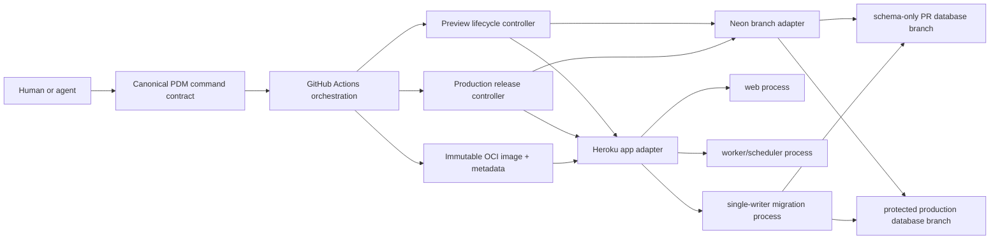
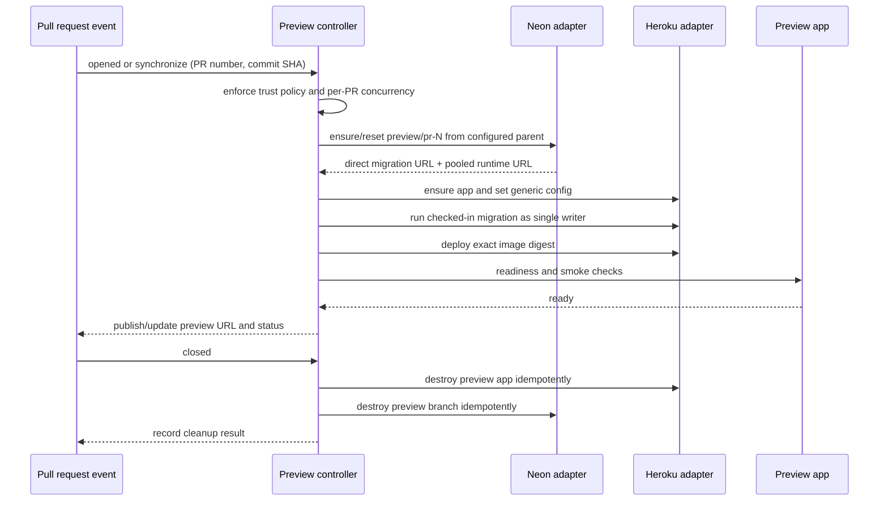
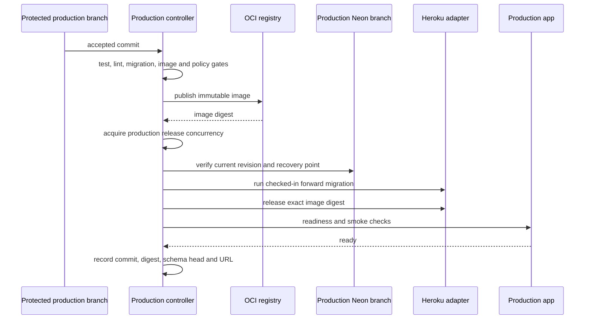

# Developer Experience Engineering Task Packet

## MVT Core

- Objective & Hypothesis: improve the `core-py` development and delivery system so that humans and agents can discover the correct workflow, create reproducible environments, validate changes early, and ship production or per-PR preview deployments with low coupling to Heroku. The working hypothesis is that a small platform contract—workspace/tooling commands, immutable build output, explicit release/migration jobs, and provider adapters for app/database lifecycle—will improve delivery reliability without introducing a large internal platform.
- Guardrails Touched: preserve current product behavior; use PDM for Python dependency management; keep implementation truth in code, tests, types, lint, and CI; keep shared product/cross-unit truth source-first in `InKCre/docs`; treat `docs/_shared/**` as read-only; keep local runtime truth in `docs/40-deployment/`; collect migration evidence before changing migrations; do not mix Hub docs, shared-ref bumps, and Spoke-local changes in one commit; do not include unrelated existing `pyproject.toml`, `portless.json`, or task changes.
- Verification: inventory the current developer and delivery paths; reproduce and explain migration-chain problems; define a provider-neutral build/release contract; prove the proposed production and PR-preview lifecycles as sequence diagrams and acceptance criteria; identify automated checks for workspace integrity, migration safety, preview creation/teardown, rollback, and shared-doc freshness; obtain explicit user authorization before implementation.

## Current Control Surface

- Status: Executions 01–08 are complete. Production delivery, recovery, schema convergence,
  OCI validation, deterministic preview databases, manual preview delivery, and automatic
  preview create/update/delete all have recorded execution evidence.
- Current Understanding: the trusted PR-target workflow now deploys the exact synchronized
  head after repository, artifact, and Neon checks; formatting and residual action-runtime
  debt are executable contracts; obsolete API-documentation automation is removed.
- Active Mode: Solidify complete; see
  [`execution-08-dx-closure.md`](execution-08-dx-closure.md) for the final proof.
- Next Step: open a new packet for any later platform enhancement; do not resume the
  historical Explore plan below as current work.

## Historical Opening Classification And Mode

- Input types:
  - Constraint: development tooling, package/workspace structure, CI/CD, deploy portability, and environment topology.
  - Reality: the reported database migration problems and any additional observed delivery blockers.
  - Artifact: this task packet and the eventual phased implementation plan.
- Opening mode (historical): Explore.
- Exit from Explore: evidence is sufficient to choose a target architecture and split it into independently verifiable execution slices.
- Expected next modes:
  - Diagnose for migration-chain and current deployment mismatches.
  - Solidify for the development-platform contract and durable documentation ownership.
  - Execute only after explicit user authorization.

## Current State

- User-confirmed:
  - Heroku remains the near-term application runtime.
  - Neon remains the database provider.
  - CD must support production and one preview environment per pull request.
  - Preview databases should use Neon database branches.
  - Future migration away from Heroku should remain easy.
  - `InKCre/docs` owns shared PRD and Product TDD material.
  - Agent-friendly human-agent collaboration is a primary design goal.
  - Git `main` is the intended production branch.
  - Checked-in extensions form a fixed built-in image profile.
  - PDM workspace is outside the current task; it is optional polish after the engineering baseline is healthy.
  - A deliberate hard cut-off, including migration-history reset, is acceptable when it removes historical debt more safely than preserving compatibility.
  - Existing production business data must be preserved. It is not seed data and must never be reconstructed from deterministic preview fixtures.
  - A logical dump and restore rehearsal is acceptable as part of preservation and cut-over, but no production-data mutation is authorized during Explore.
- Repository-confirmed:
  - `core-py` is a Spoke repo; shared truth is mounted at `docs/_shared`.
  - PDM is the required package manager.
  - `tasks/` is the correct local workspace for this volatile exploration.
  - The worktree already contains unrelated changes; they must remain untouched.
- Temporary assumptions to verify:
  - “PDM workspace” is valuable only if the repository has multiple independently useful Python packages or needs one lock/command surface across local packages.
  - A provider-neutral OCI image plus explicit build, release, migration, health, and rollback contracts can keep Heroku replaceable.
  - Preview lifecycle orchestration should be driven by pull-request events and be idempotent, including cleanup on PR close.
  - Schema migrations should run as a single-writer release step, never as an implicit web-process startup side effect.

## Unknowns and Evidence Plan

| Question | Why it matters | Evidence / verification |
|---|---|---|
| What package boundaries exist today, and would PDM workspace reduce or add complexity? | Workspace adoption must solve a real topology problem. | Inspect `pyproject.toml`, lockfile, local packages, scripts, test/lint/type-check entrypoints, and contributor setup. |
| What is the current build and deploy contract? | Portability depends on separating application contract from provider wiring. | Inspect Docker/Procfile/Heroku/GitHub Actions/runtime configuration and deployment docs. |
| How are Alembic revisions produced and applied today? | Preview and production CD cannot be reliable with an ambiguous migration lifecycle. | Inspect Alembic config/env, revision graph, startup hooks, tests, and database URL handling; reproduce graph checks. |
| How should a PR map to app, database branch, secrets, URL, and teardown? | Lifecycle ownership determines reliability and cost leakage. | Model create/update/close/retry sequences and failure compensation. |
| Which claims belong in `InKCre/docs` versus this Spoke? | Shared truth and runtime truth have different owners. | Apply Hub/Spoke ownership test after evidence is stable. |
| Which additional engineering gaps block safe CD? | CD exposes hidden gaps in tests, observability, health checks, rollback, secrets, and concurrency. | Audit CI gates, test isolation, config validation, release concurrency, backups, telemetry, and cleanup controls. |

## Candidate Target Contract

This is a hypothesis, not yet a decision:

1. One canonical developer command surface for setup, checks, tests, database operations, and local services.
2. One reproducible application artifact, preferably an OCI image, promoted through environments without environment-specific rebuilds.
3. Provider-neutral lifecycle interfaces:
   - build artifact
   - configure environment
   - run migration/release job
   - start web/worker processes
   - verify health/readiness
   - roll back application
   - provision and destroy preview resources
4. Thin provider adapters for Heroku and Neon, isolated from application code.
5. PR preview state keyed by an immutable PR identity, with idempotent create/update/destroy operations and automatic garbage collection.
6. Production database changes governed by backward-compatible expand/migrate/contract sequencing where zero-downtime behavior is required.
7. Machine-readable agent entrypoints and checks so an agent can determine repository state and the safe next action without tribal knowledge.

## Explicit Exclusions for Explore

- No business behavior change.
- No code, dependency, lockfile, CI/CD, Heroku, Neon, or migration mutation.
- No direct edit under `docs/_shared/**`.
- No Hub source edit, shared-ref bump, commit, push, or external resource creation.
- No assumption that PDM workspace is the desired answer before package-topology evidence exists.

## Shared-Doc Pressure

- Local seam: developer tooling, deployment topology, environment lifecycle, and database migration policy in `core-py`.
- Potential missing shared rule: cross-repository expectations for preview environments and any contracts other units must rely on.
- Local consequence if unresolved: local automation may encode an implicit global contract that other units cannot discover or safely depend on.
- Verification pressure after return: promote only stable cross-unit claims to `InKCre/docs`; keep Heroku/Neon operational mechanics and `core-py` internals local.

## Decision Log

- 2026-07-23: opened as Constraint + Reality + Artifact in Explore mode.
- 2026-07-23: task packet creation is the only authorized mutation; implementation still requires explicit user start.
- 2026-07-23: current evidence rejects adopting PDM workspace as the first implementation step. Workspace support was added in PDM 2.28.0 as experimental, while the repository currently runs unpinned PDM 2.27.0 and uses dynamic, optional, non-distribution extension projects.
- 2026-07-23: current evidence favors GitHub-orchestrated preview lifecycle with thin Heroku and Neon adapters over making native Heroku Review Apps the lifecycle authority. The database must exist and be configured before migration/release, and that ordering should remain portable.
- 2026-07-23: no migration repair can be selected until every long-lived database's actual `alembic_version` and schema fingerprint are collected read-only.
- 2026-07-23: user removed PDM workspace from this task and selected a fixed built-in profile for checked-in extensions.
- 2026-07-23: user confirmed Git `main` as the production policy branch and authorized a hard cut-off, including migration reset, if Phase 0 evidence supports it.
- 2026-07-23: hard cut-off permission does not authorize mutation during Phase 0; external inventory remains strictly read-only.
- 2026-07-23: user made preservation of existing production business data a hard invariant. Migration-history reset may replace Alembic metadata and revision files, but it may not treat production rows as seed or silently discard runtime-owned database objects.
- 2026-07-23: the current production-data source is the populated Neon branch named `staging`, reached by the only Heroku core app, also named `inkcre-core-staging`. Labels do not override this observed data-flow fact.
- 2026-07-23: the recommended cut-over posture is copy-and-rebaseline, not in-place destruction: create a recoverable copy from the current data branch, prove logical backup/restore independently, reconcile schema, stamp a new audited baseline only after equivalence, then switch a new production app. The existing data branch remains untouched until verification and rollback windows pass.
- 2026-07-23: the seven commits unique to `main` are a Cloudflare deployment experiment and its complete revert; the current `main` tree is identical to the `main`/`develop` merge-base. Prefer a reviewed, history-preserving merge of the prepared `develop` baseline into `main` over a force-reset.

## Evidence Snapshot

### Critical delivery blockers

1. `Procfile` runs `alembic revision --autogenerate` during every Heroku release.
   - Alembic autogenerate produces a candidate file that requires review.
   - The generated file is not committed and does not survive as repository history.
   - A database can therefore point at a revision that the next release cannot locate.
2. Migration history has already been rewritten:
   - commit `433bb90` deleted sixteen prior revision files;
   - commit `a33e4af` edited the contents of both current committed revisions after creation;
   - commit `f0dc2e8` later inserted the block `updated_at` trigger into the already-published initial revision;
   - current repository history is a single `e5a01f9e69ef -> a1b2c3d4e5f6` chain, but that does not prove any deployed database is on that chain.
   - a database that had already reached `a1b2c3d4e5f6` before the trigger edit will never execute the newly inserted initial-revision statements, despite reporting the current head.
3. Container output is not release-capable:
   - `.dockerignore` excludes `migrations/versions/`;
   - the final image omits `libs/` and `extensions/`, even though runtime imports them;
   - extension subproject environments installed in the builder are not copied into the final image;
   - the image command fixes port `8000` instead of honoring platform `$PORT`.
4. No application CI or CD gate exists:
   - there is no test, lint, type, image-build, migration, preview-app, production-deploy, or rollback workflow;
   - the OpenAPI workflow is manual-only;
   - the Neon PR workflow creates a database branch and schema diff, but nothing consumes its connection URL.
5. Preview cleanup is not reliable:
   - branch creation and deletion use different names;
   - branch name is derived from a mutable Git branch name rather than immutable PR number;
   - hosted-agent branches lack a complete teardown path;
   - no janitor reconciles open PRs against leaked Heroku apps or Neon branches.
6. Migration execution is coupled to unrelated application configuration:
   - `migrations/env.py` imports the global application `settings`;
   - Alembic therefore requires `JWT_SECRET`, although it only needs a database connection;
   - `app.json` declares no required environment configuration.
7. Database bootstrap assumptions conflict:
   - the initial revision grants `authenticated` to hard-coded role `postgres`;
   - `migrations/grant.sql` instead targets `neondb_owner`;
   - role creation, grant membership, and `vector` installation capabilities are not verified per provider.

### Developer-experience blockers

1. The repository has no canonical `setup`, `doctor`, `check`, `test`, `lint`, `format`, or `ci` command surface.
2. `pdm run ruff check --no-cache .` currently fails with 79 findings, so lint cannot be enabled as an immediate green gate without a deliberate baseline slice.
3. `pdm run pytest` fails during collection because import path behavior is implicit.
4. `pdm run python -m pytest` gets further but still fails during collection:
   - stale Mail test import;
   - RSS import performs a database write during class registration;
   - Twitter schema/resolver has a circular import.
5. The pre-commit hook uses Windows-only `cmd /c`, modifies `requirements.txt`, and stages it implicitly.
6. `migrations/AGENTS.md` says `db:generate` also upgrades the database, while the actual PDM script only generates a revision.
7. Local ignored editor configuration contains a credential-shaped Neon connection string. If it is live, it must be rotated; future setup must keep secrets out of editor and agent configuration.
8. Settings tests read local `.env` through Pydantic settings even when tests patch process environment, making tests non-hermetic and capable of leaking local configuration into failures.
9. Alembic metadata includes the `logs` table only through a side-effect import of `LogModel`; lint currently reports it as unused, so the registration contract is obscure and fragile.

### Package and extension topology

1. The root project and six extension projects all use `distribution = false`.
2. Only RSS and Twitter have independent lockfiles.
3. Root lock does not describe all extension dependencies, while the current local environment contains packages outside the root lock.
4. Runtime extension membership is dynamic: `ExtensionManager` can download and unpack arbitrary extension wheels from PyPI.
5. PDM workspace members are implicit editable dependencies sharing the root environment and lockfile.
6. Therefore, placing all current extensions in one workspace would collapse an unresolved plugin isolation boundary into one environment and still could not lock arbitrary runtime-downloaded members.

### Phase 0 external inventory — 2026-07-23

GitHub:

1. `InKCre/core-py` uses `main` as its default branch.
2. `origin/main` and `origin/develop` have diverged since commit `a1c9680`:
   - `main` has 7 unique commits;
   - `develop` has 131 unique commits.
3. The current `main` tree does not contain `Procfile`, `app.json`, `Dockerfile`, `docker-compose.yml`, or `.github/workflows/`; the delivery anchors under audit exist on `develop`.
4. `main` has no required status checks, required approvals, or admin enforcement.
5. GitHub `production` environment exists but has no protection rules or branch policy.
6. Repository-level Neon configuration names exist:
   - secret names: `DATABASE_URL`, `NEON_API_KEY`;
   - variable name: `NEON_PROJECT_ID`.
   Their values are not readable through GitHub and were not requested or exposed.
7. Historical GitHub production deployments were recorded by Zeabur, not Heroku; the latest visible successful record is from 2025-08-20.
8. An active GitHub webhook points at Heroku infrastructure, but GitHub metadata does not reveal the Heroku app identity.

Heroku:

1. Heroku authentication is available and the account has one relevant app, `inkcre-core-staging`; there is no core production app.
2. Pipeline `inkcre-core` contains only `inkcre-core-staging`, coupled to stage `staging`.
3. Its GitHub integration targets `InKCre/core-py` branch `staging`; automatic deploy, wait-for-CI, Review Apps, automatic PR deploy, and automatic PR cleanup are disabled.
4. The app uses the classic `heroku/python` buildpack on `heroku-24`, not the repository OCI image.
5. It has only an Eco `web.1` process and no release or worker process. The web process is currently crashed.
6. The last active successful release is v44 at commit `31913c19`. Releases v45 through v52 failed; v52 is commit `1a448025`, which introduced deploy-time migration autogeneration. Retained release logs were unavailable, so this is strong correlation rather than a proven error message.
7. The only domain is the default Heroku domain; no custom production domain exists.
8. Config key names are `DATABASE_SCALE_0`, `DATABASE_URL`, `JWT_SECRET`, `LLM_SP_AK`, and `LLM_SP_BASE_URL`.
9. The safely parsed `DATABASE_URL` hostname exactly matches the pooled endpoint of Neon branch `staging`; no credential, username, or connection URL was recorded.
10. No Heroku configuration, process, release, pipeline, or app was mutated.

Neon and database:

1. The official current Neon CLI is authenticated. The configured Neon MCP is not exposed inside this already-running Codex task, but it is no longer a blocker.
2. Organization inventory contains one relevant project:
   - project ID `small-feather-66252738`;
   - name `InKCre`;
   - region `aws-ap-southeast-1`;
   - PostgreSQL 17;
   - history retention 21,600 seconds, or six hours.
3. Branch topology:
   - `master` (`br-long-night-a189zt4n`) is the root, default, ready, unprotected branch;
   - `staging` (`br-broad-bread-a1j7v4ct`) is a ready, unprotected child of `master`;
   - `develop` (`br-cold-snow-a1qtt57m`) is an archived, unprotected child of `staging`;
   - no PR preview branches exist;
   - no Neon snapshots exist.
4. `master/neondb` is fresh/empty:
   - database size 7,520,256 bytes;
   - no Alembic table, application relation, application function, trigger, enum, index, or `vector` extension;
   - only built-in `plpgsql` is installed.
5. `staging/neondb` is the populated production-data source:
   - Heroku `inkcre-core-staging` points to its pooled endpoint;
   - database size 9,895,936 bytes;
   - Alembic reports `a1b2c3d4e5f6`;
   - twelve application tables plus `alembic_version`;
   - 63 columns, 21 constraints, 13 indexes, six sequences, eight enum values, one application trigger/function, and no row-level security policies;
   - `vector` 0.8.0 is installed;
   - `update_blocks_updated_at` and `update_updated_at_column()` exist;
   - no large objects or publications were found.
6. The production schema is not equivalent to current ORM metadata despite reporting repository head:
   - forced read-only Alembic comparison found 19 differences;
   - the live `blocks.storage` foreign key is `ON DELETE RESTRICT`, while current metadata expects `ON UPDATE CASCADE ON DELETE SET NULL`;
   - multiple current-model nullable constraints disagree with the live schema;
   - `logs.id` and several text fields disagree by reflected type;
   - therefore `alembic_version=head` is not proof of schema equivalence, and fresh install behavior cannot be assumed to match production.
7. Role and grant state also proves rewritten history:
   - `authenticated` and `neondb_owner` exist and `neondb_owner` is a member of `authenticated`;
   - no `postgres` role exists;
   - the current initial revision hard-codes `GRANT authenticated TO postgres`, so it cannot describe how this Neon database actually reached its current state;
   - application table grants to `authenticated` are present.
8. Read-only catalog fingerprints were collected for columns, constraints, indexes, privileges, and the combined schema without reading business row content.
9. The current workstation has neither `pg_dump` nor `psql`; the recovery execution packet must supply and pin a PostgreSQL 17-compatible client rather than depend on ambient developer tooling.
10. The ignored legacy connection remains credential-shaped and should be rotated or removed if still live. No credential was recorded in this packet.
11. No branch, database, snapshot, role, schema, row, configuration, or Neon setting was mutated.

### Phase 0 classification

| Environment | Observed classification | Treatment hypothesis |
|---|---|---|
| Neon `master/neondb` | Fresh/empty, default branch, unprotected | Do not mistake for production. Keep out of cut-over until its future role is explicit. |
| Neon `staging/neondb` | Populated schema, repository head recorded, schema/metadata drift, actual current data source | Preserve as the recovery source. Do not reset or stamp in place before a verified copy and logical backup exist. |
| Neon `develop/neondb` | Archived development branch | Treat as disposable after confirming no separately owned data; recreate from the new baseline rather than carrying history forward. |
| Heroku `inkcre-core-staging` | Only core app, points to Neon `staging`, crashed, stale release | Evidence source only. Do not promote it by renaming in place; create and verify a new production app before traffic cut-over. |
| Git `main` | Intended production policy branch, divergent and missing delivery anchors | Reconcile deliberately; it cannot be deployed safely in its current tree. |

Phase 0 control-plane access is no longer blocked. Remaining diagnostic decisions are the `main` reconciliation method, the target production branch identity, and the exact audited schema reconciliation before a new baseline.

## Target Topology Hypothesis

Provider-neutral core contract:

- artifact: immutable OCI image identified by commit SHA and digest;
- runtime processes: `web`, `worker` or explicitly single-instance scheduler, and `migrate`;
- configuration: generic validated environment variables, with separate pooled runtime and direct migration URLs when required;
- probes: liveness for process health, readiness for DB reachability, expected schema revision, and critical startup invariants;
- release: one migration writer, checked-in revisions only, serialization, health verification, and recorded artifact/schema identity;
- preview: idempotent ensure/update/destroy keyed by PR number, with TTL and reconciliation janitor;
- rollback: application artifact rollback is independent; database changes use forward-compatible expand/migrate/contract and compensating revisions.

## Preview Sequence Hypothesis

Backstops:

- schema-only branches plus deterministic non-production seed data;
- fork PRs receive no infrastructure secrets without explicit trust/approval;
- cleanup runs on PR close and a scheduled janitor reconciles stale resources;
- repeated or partially failed events converge on the same resource state.

## Production Sequence Hypothesis

## Candidate Decisions

| Decision | Recommended posture | Rationale | Revisit trigger |
|---|---|---|---|
| PDM workspace | Excluded from this task | It is optional polish and would distract from the missing engineering baseline. | A separate future task after CI/CD and package boundaries are healthy. |
| Built-in extensions | Bundle an explicitly selected set into the immutable app image | Makes production and preview reproducible and testable. | A real third-party extension isolation/runtime-loading requirement is solidified. |
| Dynamic extensions | Keep out of the CD critical path until isolation, dependency, signature and rollback contracts exist | Runtime package download makes artifact identity and dependency state non-deterministic. | Product-level extension marketplace or independent deployment pressure appears. |
| Preview orchestration | GitHub-owned controller with Heroku and Neon adapters | Preserves lifecycle ordering, idempotency, cleanup, observability, and future provider replacement. | Native Heroku Review Apps can satisfy dynamic DB configuration without becoming the authority. |
| Preview data | Schema-only Neon branch plus deterministic seed | Avoids production-data leakage and makes tests reproducible. | A sanitized dataset contract is required for realistic review. |
| Database migration | Checked-in append-only revisions, explicit single-writer release job | Restores reviewability and prevents invisible heads. | Never; this is a baseline invariant. |
| Existing production data | Preserve by Neon branch copy plus independent logical backup and restore rehearsal | Separates data preservation from migration-history cleanup and supplies both fast provider-native rollback and portable recovery. | Restore rehearsal proves an alternative method safer. |
| Migration hard cut | Create one new audited baseline and stamp only a schema-equivalent copied database | Current head and live schema disagree, so continuing the rewritten chain is not trustworthy; stamping the original source in place would weaken rollback. | Schema reconciliation cannot be proven without a clean rebuild and data-only restore. |
| Target production database | Create a dedicated, protected `production` branch from the current populated branch at the maintenance-window recovery point | Makes Git `main` → environment `production` explicit while leaving the mislabeled source branch intact for rollback. | Neon plan/capability or branch-parent behavior makes a copied branch operationally unsuitable. |
| Git `main` reconciliation | Prepare and verify the delivery baseline from `develop`, then merge it into `main` through a reviewed PR | `main` has no net tree delta from the common ancestor, so a normal merge preserves audit history without carrying an unresolved content conflict. | A final commit-level audit finds an intentionally retained main-only semantic change. |
| Scheduler | Separate worker or explicit distributed/singleton lock | Multiple web replicas currently duplicate periodic jobs. | Deployment is permanently constrained to exactly one process. |
| Heroku portability | OCI/process/config contract first; Heroku mapping second | Keeps provider-specific logic shallow. | Another runtime proves the contract insufficient. |

## Production Data Preservation and Migration Recovery Gate

The production-data invariant is stronger than migration-history continuity. A migration reset may discard untrustworthy Alembic history; it may not discard or synthesize the current production rows.

Before changing `Procfile`, revision files, or any database:

1. Read, without mutating, every long-lived environment's:
   - `alembic_version` rows;
   - table, column, constraint, index, enum, extension, trigger, function, role, and grant fingerprint;
   - current Heroku release and source commit;
   - Neon branch identity and parent.
   - presence of the block update trigger/function and `vector` extension;
   - current/session roles, role-creation capability, `authenticated` membership, and effective grants;
   - whether the exact release image contains `libs/` and the committed revision graph.
2. Classify each environment:
   - known current revision;
   - deleted historical revision;
   - deploy-generated unknown revision;
   - unversioned but populated schema;
   - fresh/empty.
3. Establish dual recovery before the maintenance window:
   - create a provider-native recovery point or immutable branch copy from the populated source;
   - take a custom-format `pg_dump` over a direct/unpooled connection;
   - capture globals separately with `pg_dumpall --globals-only`;
   - include large objects and record PostgreSQL client/server versions;
   - encrypt and store the archives outside the repository;
   - record SHA-256 checksums, source branch ID, source LSN/timestamp, schema fingerprint, Alembic row, application commit, and dump tool version.
4. Rehearse logical restore into an isolated non-production target:
   - restore extensions and provider-supported roles deliberately;
   - restore schema/data or restore data into the new baseline, according to the selected cut;
   - validate table counts, primary/foreign keys, sequence values, enums, vector dimensions/indexes, triggers/functions, grants, owners, row-level security, and large objects;
   - run application read/write smoke checks against the isolated target;
   - retain the rehearsal evidence and destroy the target only after verification.
5. At cut-over, freeze all writers:
   - enable an explicit maintenance state;
   - stop web writes, workers, schedulers, webhooks, and any external writer;
   - drain in-flight transactions;
   - capture the final recovery branch/snapshot, logical dump, checksums, counts, sequence state, and schema fingerprint;
   - do not proceed if the final evidence differs unexpectedly from rehearsal.
6. Select migration recovery per class:
   - append a normal migration only when the chain and schema agree;
   - use an audited environment-specific `stamp` only when schema equivalence is proven;
   - create a deliberate new baseline only if fresh installs and existing histories cannot share a safe chain;
   - never repair by blindly deleting `alembic_version`, stamping `head`, or rerunning autogenerate.
7. Recommended hard-cut sequence for the populated source:
   - leave current Neon `staging` untouched as recovery source;
   - create a new `production` branch at the frozen recovery point and protect it;
   - apply an explicit, reviewed schema reconciliation only on the copied target;
   - compare its full catalog fingerprint with the approved target schema;
   - replace only the target's Alembic metadata with the new baseline after equivalence;
   - prove that the same baseline can build a fresh empty database;
   - deploy a new Heroku production app to the copied target;
   - switch traffic only after readiness and smoke checks;
   - retain old app/branch until rollback and backup-retention gates expire.
8. After recovery, enforce:
   - exactly one repository head;
   - no modified or deleted committed revisions;
   - upgrade from an empty supported Postgres/Neon-compatible database;
   - upgrade from the previous released schema;
   - `alembic check` against the upgraded database;
   - explicit tests for objects not represented by ORM metadata;
   - an explicit metadata registration assertion for the `logs` table;
   - provider-neutral ownership/role bootstrap outside application schema migrations where necessary.

## Phased Roadmap

### Phase 0 — Diagnose and contain

- inventory real database revision/schema state without mutation;
- pause or guard production releases that would execute deploy-time autogenerate;
- rotate the ignored local Neon credential if it is live;
- locate leaked preview/hosted-agent branches and define cleanup targets;
- identify the current Heroku production app, pipeline, release and build contract;
- identify the Neon project, production/default branch, development branch, parent topology and existing preview branches;
- choose between an audited migration bridge and a deliberate migration-history reset;
- define the `main` reconciliation/cut-over from the current divergent `develop` history.
- define production-data recovery artifacts, maintenance-window writer freeze, restore rehearsal, cut-over validation, and rollback retention.

Exit proof:

- every long-lived DB is classified;
- the migration recovery operation is explicit per environment;
- the production-data source, backup/restore acceptance criteria, and non-seed invariant are explicit;
- no new invisible revision can be produced;
- GitHub, Heroku and Neon production identities are explicit;
- the main-branch cut-over operation and fixed built-in profile are recorded.

### Phase 1 — Establish a green developer contract

- pin Python and PDM consistently across local, CI, and image builds;
- provide canonical `setup`, `doctor`, `dev`, `lint`, `format`, `test`, `check`, `openapi`, and explicit `db:*` commands;
- remove import-time database writes from unit-test collection paths;
- repair stale/circular extension tests and define unit versus integration markers;
- make pre-commit cross-platform and non-staging;
- introduce CI with lock freshness, focused lint baseline, tests, migration graph guards, shared-ref freshness, and import smoke.

Exit proof:

- a fresh agent can set up and run `doctor` then `check` from documented commands only;
- local commands and CI execute the same implementation;
- every gate is green on the protected branch.

### Phase 2 — Produce a portable release artifact

- repair migration history according to Phase 0 evidence;
- rehearse the production logical backup and restore path without modifying the production-data source;
- remove deploy-time revision generation;
- build an immutable OCI image containing all required core code, selected extensions, dependencies, and revision files;
- honor `$PORT`;
- separate `web`, migration, and scheduler/worker responsibilities;
- add liveness, readiness, and artifact/schema identity;
- smoke-test the image with disposable Postgres before publishing.

Exit proof:

- one image digest boots locally and on Heroku;
- fresh-schema and previous-schema migration paths pass;
- no release step changes repository history or generates migration files;
- readiness fails when schema or DB state is invalid.

### Phase 3 — Deliver per-PR previews

- implement idempotent preview ensure/update/destroy commands with structured output;
- create/reset Neon branch by PR number;
- run migrations and deterministic seed;
- configure and deploy Heroku preview app;
- report URL and state on the PR;
- enforce trust policy, concurrency, compensation, TTL, and janitor cleanup.

Exit proof:

- opened, synchronize, reopened, closed, retry, cancellation, and partial-failure cases converge correctly;
- each PR has at most one app and one DB branch;
- closed PR resources are removed and janitor detects deliberate test leaks.

### Phase 4 — Deliver production CD

- protect the production environment and serialize releases;
- create the dedicated protected Neon production branch and new Heroku production app through the verified cut-over runbook;
- publish and deploy immutable image digests;
- verify migration preconditions and recovery point;
- run checked-in migration once;
- gate success on readiness and smoke;
- record release identity and exercise application rollback.

Exit proof:

- a successful release is traceable from commit to image digest to schema head;
- a failed app rollout can return to the previous compatible image;
- provider-specific code is confined to adapters and documented runtime mapping.

### Phase 5 — Evaluate platform extraction

- keep deployment controller local until a second Spoke proves a reusable cross-repo contract;
- promote only validated cross-unit claims to `InKCre/docs`.
- leave PDM workspace to a separate future task.

## Open Decisions for Human-Agent Discussion

1. Should the target dedicated Neon branch be named `production` and created from the frozen current `staging` source, as recommended, or should the existing branch be renamed in place?
2. Approve the recommended history-preserving PR merge from the prepared `develop` baseline into `main`, or require a squash/hard reset despite there being no net main-only tree content?
3. Should runtime download of non-checked-in extensions be disabled in production images?
4. Should preview creation be automatic for trusted same-repository PRs and manual for fork PRs?
5. Is schema-only plus deterministic seed sufficient for preview review?
6. Should the scheduler become a Heroku `worker` process now, or remain single-instance with an explicit lock?
7. What is the acceptable production deployment approval policy: fully automatic after protected-branch merge, or an environment approval gate?
8. Does any archived `develop` database content have independent retention value, or may the branch be recreated from the new baseline?

## Historical Next Step

Solidify the Phase 0 evidence into an executable series of small task packets:

1. contain deploy-time autogeneration and establish a green migration/DX command contract;
2. reconcile `main` and pin the immutable build contract;
3. create and test the new migration baseline on disposable databases;
4. rehearse production backup/restore and catalog validation;
5. execute the protected Neon/Heroku production cut-over;
6. add idempotent per-PR preview lifecycle and cleanup.

No implementation or infrastructure mutation begins until the user explicitly starts the selected execution packet.
