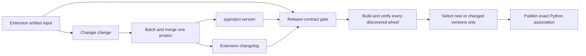

# First-Party Extension Release Contract

## MVT Core

- **Objective & Hypothesis**: make release intent explicit and checkable for every
  first-party Core Extension. The working hypothesis is that one producer-scoped
  Changie project per Extension, one discovered project set, and one pre-merge
  release-contract gate can prevent unchanged-version publication failures without
  moving publication authority out of the existing Registry delivery controller.
- **Guardrails Touched**: preserve `pyproject.toml [project].version` as the Python
  Distribution version authority; preserve the Registry Release as the cross-format
  aggregate while each producer owns only its association; use ordinary wheels and
  the current Extension Host; keep publication credentials out of pull-request CI;
  do not change Extension runtime, database state, business behavior, root Core
  versioning, or `docs/_shared/**`.
- **Verification**: prove static project coverage and version/changelog agreement;
  run transition probes against a base revision; build and verify every discovered
  first-party wheel; pass repository CI and preview delivery; then publish and read
  back the first Memos Python association from the public Registry.

## Current Control Surface

- **Status**: implementation and local verification complete; commit, pull-request CI,
  preview, publication, and public read-back remain pending.
- **Active Mode**: clean up and Human review before any commit or push.
- **Current Understanding**: one discovery surface now drives checks, wheel tests, and
  publication for seven independent Python Extension producers. Automatic delivery is
  version-driven; Memos `0.1.1` is the only new version relative to `origin/main`.
- **Next Step**: present the local result and residual to the Human, then wait for
  explicit commit/push authority.

## Unit Boundary

### In scope

- First-party projects under `extensions/*/pyproject.toml`:
  `github`, `learn_english`, `mail`, `memos`, `rss`, `telegram`, and `twitter`.
- One Changie multi-project configuration with a generated changelog and version
  replacement for every discovered Extension.
- A narrow Extension release tool that owns discovery, repository-state checks,
  base/head transition checks, project listing, and release preparation.
- A pre-merge CI gate for Extension release intent.
- Version-driven automatic Registry publication and discovery-driven wheel/publish
  enumeration.
- Memos native Distribution closure as the end-to-end acceptance slice.
- Local Extension authoring and native-distribution documentation updates.

### Out of scope

- Root `inkcre-core` version management.
- Git tags, GitHub Releases, automated release pull requests, or release bots.
- Cross-repository lockstep between a Python association and a Module Federation
  association. They may converge on the same exact Registry Release, but each
  producer advances and publishes only its owned association.
- Extension runtime, database schema/data, Host installation semantics, or product
  behavior changes.
- Shared Hub documentation or Spoke shared-ref updates.

## Confirmed Topology

Authority and dependency direction:

1. Each Extension `pyproject.toml` owns its Python Distribution identity and version.
2. Changie owns release preparation: version entry, changelog projection, and the
   mechanical version replacement.
3. The release-contract tool checks repository and transition invariants; it does
   not publish.
4. Existing GitHub delivery remains the exact-artifact Registry publisher.
5. The Registry Release may contain multiple optional format associations. A Python
   producer does not rewrite or require an unchanged web association.

## Accepted Design

### Project discovery

- Discover immediate `extensions/*/pyproject.toml` projects that declare
  `[tool.inkcre-extension]`; do not introduce another hand-maintained manifest.
- The same discovery output drives repository wheel verification, lifecycle probes,
  and the publication matrix.
- Changie necessarily lists projects in its configuration; the release gate proves
  that every discovered producer is registered and has an addressable changelog.

### Release intent

- The artifact-input surface is an Extension subtree excluding generated
  `CHANGELOG.md`. Python source, `pyproject.toml`, README, and other wheel metadata
  are release-relevant.
- If that surface changes relative to the base project, the project version must
  advance. New projects use their declared version as the initial Release.
- A version change must have a generated Changie version entry, and Changie's latest
  project version must equal `pyproject.toml [project].version`.
- Changelog-only correction does not demand another version bump or publication.
- Existing exact versions are bootstrapped honestly; release history before Changie
  adoption is not reconstructed from guesses.

### CI and delivery

- Install the official Changie action at a commit-pinned revision and request exact
  Changie `v1.25.2`.
- Run the release-contract gate before main publication. Invalid fragments, missing
  project registration, source-without-version intent, or generated-state drift fail
  before merge.
- Automatic publication selects only a new project or a changed project version,
  not arbitrary subtree changes.
- Revalidation before Registry mutation continues to reject superseded artifact
  input while allowing generated changelog-only edits to remain non-publishing.
- Pull-request CI has no Registry mutation capability. Existing production
  environment secrets remain confined to the post-main publisher.

### Memos acceptance slice

- Memos is buildable today through the build backend's default behavior, but it is
  omitted from repository wheel CI and has no public Registry Release.
- Add the same explicit setuptools build-system contract used by the other
  first-party producers.
- Prepare Memos `0.1.1` through Changie. This is a real Distribution metadata
  hardening change and exercises the normal version-driven publisher rather than a
  one-off initial-publication exception.
- The public acceptance target is `inkcre/memos@0.1.1` with a published Python
  association that names `core-py` and the expected entry point.

## Implementation Plan

1. **Release preparation foundation**
   - add `.changie.yaml`, shared header/unreleased layout, and seven project entries;
   - bootstrap per-project version records and generated changelogs without inventing
     historical product claims;
   - add concise author commands and tool installation guidance.
2. **Deep release-contract module**
   - implement first-party discovery and machine-readable list output;
   - implement repository-state and optional base/head transition validation;
   - implement one-project Changie batch/merge preparation command;
   - keep the module independent of Registry credentials and business runtime.
3. **CI and publisher convergence**
   - add the named release-contract gate to repository CI;
   - replace six-item wheel loops and hard-coded test enumeration with discovery;
   - make the publication matrix discovery-driven;
   - change automatic selection from subtree diff to version transition.
4. **Memos vertical closure**
   - add explicit build-system metadata;
   - generate the Memos `0.1.1` release state;
   - build and exercise its installed-wheel lifecycle with the other six producers.
5. **Documentation and task-state closure**
   - update `extensions/AGENTS.md`, `extensions/README.md`, and
     `docs/40-deployment/native-extension-distribution.md`;
   - update this packet with exact local, CI, preview, publication, and public-read
     evidence before closing the unit.

## Failure-Path Preflight

| Failure | Required behavior |
|---|---|
| Extension source changes without version intent | PR CI fails before publication. |
| Manifest version and Changie latest disagree | Repository-state check fails. |
| New first-party Extension lacks Changie registration | Discovery coverage check fails. |
| Changelog-only correction | CI passes without selecting a Registry publication. |
| Existing version is selected again | Version-driven selector reports no-op. |
| New main supersedes the checked artifact input | Publisher fails before Registry mutation. |
| One Extension publish fails | Other matrix entries remain independently observable; immutable Release state is not guessed or overwritten. |
| Python and web producers are on different versions | Each owned association remains valid; no artificial cross-repository lockstep is introduced. |

## Acceptance

- `pdm run check` and `pdm run pre-commit run --all-files` pass.
- The release-contract command passes on the repository and fails in disposable
  mutation probes for:
  1. source change without a version advance;
  2. manifest/changelog version drift;
  3. an unregistered newly discovered Extension.
- All seven projects build one verified PEP 420 wheel and pass the existing installed
  lifecycle probe.
- Pull-request CI and preview deployment pass from the exact head revision.
- After merge, automatic selection publishes Memos `0.1.1`; the other six projects
  are explicit no-ops unless their versions changed.
- Anonymous Registry read-back proves `inkcre/memos@0.1.1` is published with the
  expected Python association and source provenance.
- No business runtime, database, root Core version, web association, or shared Hub
  state changes as a side effect.

## Evidence Collected

- Latest inspected base: `origin/main` at
  `4b180467dd8ca79a28a241fa5e38333692bcb4d3`.
- Seven producer projects are present; six are listed in repository wheel CI, while
  seven are listed in the publication matrix.
- Public Registry reads show published Python releases for GitHub, Learn English,
  Mail, RSS, Telegram, and Twitter; `inkcre/memos` returns HTTP 404.
- A disposable archive of exact `origin/main` built and passed
  `scripts/extension_distribution.py verify-wheel` for
  `inkcre-ext-memos-0.1.0-py3-none-any.whl`.
- Changie `v1.25.2` supports multi-project changelogs and per-project replacements;
  its official GitHub action can install an exact CLI version for subsequent steps.
- `pdm run check:extension-releases --base origin/main` passes with exact Changie
  `v1.25.2`; discovery returns all seven producer keys.
- Disposable mutation probes fail as required for source-without-version intent,
  generated changelog drift, and a discovered producer without Changie registration.
  The first probe exposed and closed a local-authoring gap: base checks now include
  tracked working-tree changes, while publication revalidation still compares two
  explicit revisions.
- `pdm run check` under the repository-pinned PDM `2.27.0` passes: 453 tests pass,
  41 are skipped, Ruff and Pyrefly are clean, and lock/migration/foundation contracts
  pass. The real Extension distribution test builds, verifies, installs, discovers,
  enables, disables, and re-enables all seven wheels.
- `pdm run pre-commit run --all-files` passes every configured hook, including
  actionlint, Ruff formatting, Pyrefly, lock, migration, and settings contracts.
- Remote CI, preview delivery, Registry mutation, and anonymous public read-back are
  intentionally not claimed before commit/push.

## Decision Log

- 2026-08-17: the Human approved expanding Changie release intent from the
  client-web Twitter producer to every first-party core-py Extension and requested an
  independent unit or an updated task packet.
- 2026-08-17: created this independent unit because it has a separate objective,
  seven-producer impact surface, CI/CD topology, and closure evidence.
- 2026-08-17: selected version-driven publication over subtree-driven publication.
- 2026-08-17: selected discovery over another first-party Extension manifest.
- 2026-08-17: selected Memos `0.1.1` as the first complete automatic publication
  journey rather than adding a one-off unpublished-`0.1.0` recovery exception.
- 2026-08-17: retained producer-local version progression; no Python/web lockstep.
- 2026-08-17: the Human explicitly authorized implementation.
- 2026-08-17: retained real distribution/lifecycle checks and removed low-value tests
  that merely reimplemented workflow text or toy Git behavior; release-policy
  invariants now live in the static CI gate and executable release tool.
