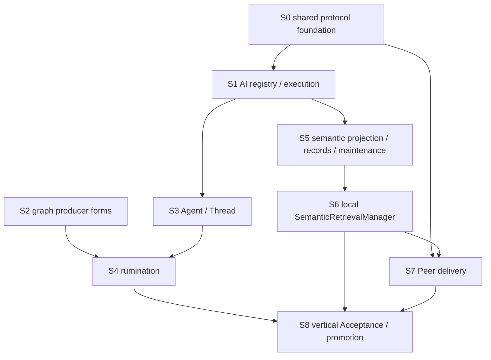

# Semantic Retrieval Delivery Map

- **Purpose**: keep one semantic-retrieval product vertical understandable while separating its implementation dependency
  surfaces。
- **Status**: design probe only。The increments below are not an approved implementation plan，do not authorize code or
  migrations and may change when Acceptance or preflight exposes a different dependency。
- **Rule**: the active unit stays one Acceptance vertical。An increment is a reversible verification boundary，not a new
  product/unit identity or an excuse to create additional runtime services。

## Dependency Topology

S1 and S2 may proceed independently after their own code-address preflight。S3 depends on chat/tool-calling execution but
not on GraphForm；it can verify its generic Tool runtime with a test Tool。S4 is the join of S2 and S3。S7's generic peer
schema/protocol groundwork may proceed early，but its semantic-retrieval inbound/outbound proof depends on S6's local
implementation。

## Provisional Increments

| Increment | Coherent state diff | Depends on | Verification boundary |
| --- | --- | --- | --- |
| S0 — shared foundation | database-owned timestamps；generic ConfigContract；deployment `configs`；required peer/config schema groundwork | approved common contracts | migration/static contract + real PostgreSQL CRUD/trigger probes |
| S1 — AI module | hard-cut process-global AI config；add AIDialect/Provider/Model and AIManager `embed`/`chat` with OpenAI-compatible adapter | S0 persistence/config | typed adapter tests + real configured provider smoke when credentials exist |
| S2 — graph producer forms | add BlockForm/RelationForm、retained StarsGraphForm authoring and flat GraphForm；replace SubGraphForm persisted-model leakage；add InfoBaseManager normalizer/write path；correct audited relations | approved D-179 producer grammar | form/static validation + real PostgreSQL arbitrary graph and targeted migration tests |
| S3 — Agent/Thread | Agent definitions、decorator Tool registry、canonical tool-call loop、in-memory thread persistence backend and structured-concurrent Tool batch | S1 | fake dialect state-machine tests + real tool-calling provider smoke |
| S4 — rumination | focal resolver/direct-relation context、deployment-config Agent selection、on-demand Resolver draft schemas、rooted GraphForm drafting、organization-owned `submit_graph(GraphForm)` and shallow completion semantics | S2、S3 | real focal Block → Agent → draft/commit graph journey；no-op/cannot-understand/failure/repetition/explicit-trigger cases |
| S5 — semantic records | Resolver/Relation projections、EmbeddingProfile/records、freshness、maintain/rebuild and default config | S0、S1 | real Memos/RSS graph → projection → vector rows；stale/unavailable/failure and repeat maintenance |
| S6 — local retrieval | SemanticRetrievalManager、exact cosine ranking、bounded filters/result and local domain route | S5 | direct local request → ranked real Block/Relation identities and scores |
| S7 — peer delivery | Peer persistence/lease、capability advertisement、HTTP protocol/outbound/inbound、any-provider/exact-target routing and bounded failover；technical Client→Peer migration；exact Extension-management consumer replacement | S0、S6 | two real peer runtimes；online selection、target constraint、non-execution failover、uncertain-outcome stop and Extension config/hot lifecycle journey |
| S8 — acceptance/promotion | approved corpus and quality thresholds across rumination、freshness、local/delegated retrieval；durable owner reconciliation | S4–S7 | black-box-first suite + repository/cross-repo static/runtime checks |

## Cross-Repository And Runtime Surfaces

- **core-py**: migrations、schemas/managers/routes、AI/Agent/config/Peer domains、info-base forms、resolver/relation
  projection、semantic maintenance/retrieval、producer corrections and test infrastructure。
- **client-web**: peer terminology and shared database DTO/protocol projection，PostgreSQL peer/config/AI/Profile rows and
  any locally implemented AI/retrieval capability demanded by parity。Exact implementation scope requires preflight；peer
  equality does not mean every runtime implements every capability。
- **Hub/shared docs**: Product TDD topology for AI/config/Peer/Agent/semantic retrieval and PRD-observable retrieval/
  organization behavior，promoted only after implementation evidence and through the shared-doc workflow。
- **Database/deployment**: migration chain and configured AI provider/model/profile/Agent/config/Peer facts。Production is a
  public demo，but migrations still require real forward/readiness verification and no silent credential/config invention。

## Plan-Building Rules

- Convert these increments into an implementation plan only after closure items 1–3 are approved。
- Preflight must verify exact code addresses and decide whether S0 needs smaller migration commits；the conceptual grouping
  here does not require one migration or one commit。
- Prefer parallel execution only where the dependency graph permits and verification remains attributable。Do not parallelize
  two increments that both rewrite the same manager/schema authority。
- Every increment must leave the repository internally coherent and must not preserve compatibility wrappers for rejected
  legacy embedding、RAG、Client or SubGraphForm authorities unless preflight finds a still-supported consumer。
