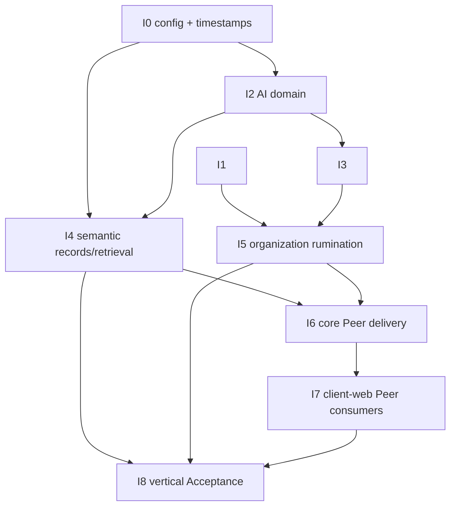

# Semantic Retrieval Implementation Plan

- **Status**: closed；I0–I8 implementation and credentialed Acceptance complete，publication operations pending authorization。
- **Inputs**: approved Product/Technical/Acceptance decisions through D-196，current core-py/client-web code and delivered
  core-py migration head `c0d1e2f3a4b5`。
- **Delivery rule**: one product unit，multiple coherent increments。Each increment must leave its repository internally
  checkable；compatibility aliases for rejected Client、SubGraph、legacy AI/embedding/RAG authorities are forbidden。

## Dependency Order

I1 may proceed independently of I0/I2。I3 and I4 share AI schema/types but otherwise may be implemented in either order
after I2；do not parallel-edit their shared AI Manager/schema files。I1 and I3 join at I5；I5 and I4 join only at
Acceptance，while I6 must see both
local business capabilities before publishing their inbound advertisements。

## I0 — Configuration Mechanics、Deployment Configs And Row Time

### State diff

- Extract model-driven complete validation、normalized JSON、shallow patch preparation and JSON Schema projection into
  `ConfigContract[Model]` under `app.configuration`。
- Add deployment-scoped `configs` persistence、schema registry、DeploymentConfigManager and honest PUT/PATCH routes。
- Refactor Extension config update to consume ConfigContract without moving Extension lifecycle into the generic module。
- Replace application-owned `onupdate` behavior with no-op-aware PostgreSQL `BEFORE UPDATE` triggers on approved shared
  rows，initially Blocks、Relations and all new mutable protocol rows introduced by this unit。

### Primary addresses

- new `app/configuration.py`；
- new `app/schemas/deployment_config.py`、`app/business/deployment_config.py`、`app/routes/deployment_config.py`；
- `app/business/extension/main.py`；
- `app/schemas/{__init__.py,info_base/block.py,info_base/relation.py}`；
- `run.py` route/config-contract registration composition；
- first new Alembic revision plus metadata/readiness/privilege surfaces。

### Verification

- static ConfigContract tests for complete/patch/schema behavior and collision-free owner boundaries；
- real PostgreSQL config CRUD/unknown-schema/invalid-persisted-value journeys；
- trigger tests proving changed row advances `updated_at`、no-op update does not and PostgREST/SQL writes behave equally；
- Extension config regression through its real Manager and running instance apply path。

## I1 — Producer Forms、Graph Commands And Relation Corrections

### State diff

- Add database-state-free `BlockForm` / `RelationForm` and rename recursive producer authoring from `SubGraphForm` to
  `StarsGraphForm` in one hard cut across every repository-owned producer。
- Add flat `GraphForm` with command-local signed Block IDs、intrinsic Pydantic structural validation and arbitrary connected
  graph support。A small Graph-owned wrapper may carry signed `id` beside BlockForm fields；it is not a persisted-model
  identity or a new information entity。
- Add `InfoBaseManager.normalize_graph(stars, id_start)` and `submit_graph(graph)`；PostgreSQL FK remains positive-reference
  existence authority。The public graph command accepts GraphForm；Resolver/extension internals keep StarsGraphForm。
- Correct the evidenced Mail sender direction in the producer；hard-cut Twitter's unused legacy
  `_organize()` writer to no-op。Do not reinterpret relations in retrieval or organization runtime。

### Primary addresses

- split `app/schemas/info_base/main.py` into a forms-owned surface and update `app/schemas/info_base/__init__.py`；
- rewrite `app/business/info_base/main.py` around normalize/submit while retaining caller-session transaction discipline；
- update `app/business/info_base/resolver/**` and all `extensions/{mail,github,rss,telegram,twitter}/**` consumers；
- check Memos' repository-owned graph helpers even where they already write directly；
- update `run.py` graph route and `app/routes/AGENTS.md`。

### Verification

- Pydantic form invariants：negative create IDs、positive references、zero rejection、unique declared IDs and known negative
  endpoints；
- real PostgreSQL arbitrary connected graph insert and negative→positive mapping；
- StarsGraphForm normalization parity over representative core/extension producers；
- producer-level black-box assertions for every audited relation，including Mail's corrected sender direction；
- structural search proving `SubGraphForm` and persisted BlockModel/RelationModel producer forms are gone。

## I2 — AI Registry、Canonical Capability Contracts And Legacy Hard Cut

### State diff

- Add AIDialect、AIProvider、AIModel and EmbeddingProfile shared models/catalogs with bigint identities and database-owned
  timestamps。Register exact `core.openai-compatible.v1` with config model containing only evidenced OpenAI-compatible
  connection values；credentials remain ordinary provider config persisted in AIProvider。
- Add graph-blind AIManager with `embedding` and `chat` capability modules、canonical Messages/Tools/ToolCalls/results and
  one OpenAI-compatible dialect adapter。Validate model capability/modalities/features、provider/model enabled state、tool
  choice support、batch order/cardinality and vector dimensions。
- Remove process-global `libs/ai.py` authority and all obsolete users：legacy Sink/RAG、Block embedding/reasoning helpers、
  block-route semantic shortcuts and eager/background legacy EmbeddingManager behavior。No wrapper preserves old APIs。

### Primary addresses

- new `app/schemas/ai/` and `app/business/ai/` deep modules，exported through package `__init__.py`；
- `app/settings.py` removes `llm_sp_*` after no consumer remains；
- delete/rework `libs/ai.py`、`app/business/sink/**`、`app/schemas/sink/**` and `/sink/rag` composition；
- trim `app/business/info_base/block.py` and `app/routes/block.py` to Block-owned behavior；
- AI/profile/record schema revision recreates legacy embedding tables rather than attempting false provenance migration。

### Migration rule

Legacy block/relation vectors are derived and cannot name their Provider、Model、Profile or semantic input。Drop and
recreate the embedding relations in their approved composite-profile shape；do not synthesize a legacy Profile。Preserve
graph entities and rebuild vectors only after an explicit/default Profile is configured。

### Verification

- model/capability/config validation and catalog-registration collision tests；
- fake OpenAI-compatible transport tests for embed/chat/tool wire translation and all validation failures；
- optional real configured provider smoke for embedding and tool calling，never required merely to type-check the module；
- structural proof that no process-global AI client、legacy RAG/EmbeddingManager or `get_str_for_embedding()` consumer
  remains。

## I3 — Persisted Agent Definitions And In-Memory Thread Runtime

### State diff

- Add `agents` rows with exact approved fields and bigint identity；no Agent seed or default Rumination Agent。
- Add AgentManager decorator-owned exact Tool registry、Pydantic input binding and runtime Tool schema projection。
- Implement replaceable thread persistence backend contract with only an in-memory backend，Thread snapshots of Agent
  definition behavior and cancellable per-turn asyncio Task。
- Execute ToolCalls concurrently inside the Turn structured-concurrency scope；commit one closed AssistantMessage +
  ToolResultMessage pair atomically，isolate ordinary per-call failures and preserve completed effects on budget/cancel。

### Primary addresses

- new `app/schemas/agent.py` and `app/business/agent/` package（manager、contracts、thread persistence/runtime）；
- AI canonical Messages/Tools from I2 are reused rather than copied；
- Agent schema belongs in the AI/semantic foundation migration or a following append-only revision。

### Verification

- deterministic fake dialect state machines for natural completion、budget exhaustion、multi-call concurrency、validation
  error、handler error、unexpected exception、cancellation and incomplete trailing-message recovery；
- registry collision、missing persisted Tool、tool set canonicalization and snapshot isolation；
- optional real tool-calling provider smoke separate from deterministic lifecycle authority。

## I4 — Semantic Projection、Embedding Records、Maintenance And Local Retrieval

### State diff

- Remove Resolver `get_str_for_embedding()` and make complete `get_text()` the text projection。Add required deterministic
  `get_label()` to all core and in-scope extension Resolvers；unsupported/null/empty remain distinct。
- Hard-cut legacy extension registrations to the exact IDs approved by D-194；retain no aliases or compatibility
  decoders。The Resolver execution checklist owns the per-ID text/label/create-graph obligations。
- Correct unreleased `extensions.rss.feed_item.v1` in place：its complete projection concatenates title、summary and full
  text/authored content，whereas the current local implementation selects only one best body。Because v1 has not reached
  any retained staging/preview deployment，reset disposable local data rather than minting v2 or a compatibility migration
  (D-193)。
- Add RelationManager subject/property/value projection using exact endpoint labels and no RelationResolver。
- Add composite-profile Block/Relation EmbeddingRecords with variable dimensions and timestamp/dimension freshness filters。
- Implement one SemanticRetrievalManager owning default Profile resolution、maintain/rebuild、query embedding、exact cosine
  comparison and one global bounded Block/Relation result。`retrieve()` never repairs candidate records。
- Register `core.semantic_retrieval.config.v1` and the default Profile config；replace the old scheduler hook with bounded
  scheduled `maintain` for only the configured default Profile。
- Add the typed local/non-delegating execution path and fixed HTTP inbound codec required later by Peer composition。

### Primary addresses

- resolver files under `app/business/info_base/resolver/**` and exact in-scope extension resolvers；
- [Resolver execution checklist](resolver-execution-checklist.md) for the complete exact text/label/producer matrix；
- `app/business/info_base/relation.py`；
- new `app/schemas/semantic_retrieval.py` and `app/business/semantic_retrieval/`；
- new `app/routes/semantic_retrieval.py`；
- `run.py` scheduler/route composition；
- embedding/profile schema and timestamp triggers from I2/I0。

### Verification

- real Memos/RSS graphs through Resolver/Relation projection；
- maintain scan pagination past unavailable candidates、provider failure、batch validation、atomic upsert and interruption；
- Block/Relation/Profile mutation makes stored rows immediately stale and excluded until maintain；
- exact mixed global ranking、tie order、limit、threshold、entity filter、dimension and default/dangling config cases；
- direct local Manager and route black boxes return real graph entities，not internal vector rows。

## I5 — Organization Rumination And Graph Tools

### State diff

- Add OrganizationManager with only `ruminate(block_id)` and a private non-delegating local execution seam；no
  RuminationManager、job、scheduler or run record。
- Register `core.organization.rumination.config.v1` and resolve the configured Agent at use time。
- Build the focal Resolver text + bounded direct-relation initial UserMessage；cannot-understand completes shallowly without
  starting Agent。
- Register `get_draft_graph_schema`、`draft_graph` and `submit_graph` Tools。Agent runtime owns one validation pass；Resolver
  owns `create_graph(input) -> StarsGraphForm`；InfoBase owns normalize/submit；submit returns negative→persisted ID mapping。
- Await the active Turn and map natural completion/no-write to `None`、budget exhaustion to one organization failure and
  caller cancellation to Turn cancellation without retry/rollback。
- Add fixed `POST /organization/ruminate` body `{block: int}` and `204` local inbound。

### Primary addresses

- new `app/business/organization.py`、`app/routes/organization.py` and owner config model；
- ResolverManager runtime schema/description snapshot and Resolver create-graph contract；
- Agent Tool registration composition；
- delete `BlockManager.query_by_reasoning()` if not already removed in I2。

### Verification

- deterministic focal context construction and direct direction rendering；
- real Resolver schema discovery/draft → GraphForm → submit journey；
- useful write、honest no-op、cannot-understand、validation/Tool failure、budget、cancel、repeat and concurrent additive cases；
- explicit route only；structural proof of no periodic/collection hook or persistent run entity。

## I6 — Core Peer Protocol、Routing And Three Capability Inbounds

### State diff

- Hard-cut technical Client→Peer：rename table/model/manager/settings/types；the new Peer shape retains UUID identity、name、
  labels、config and config_schema semantics，drops `rest_api_url` and adds capabilities snapshot、lease expiry and
  updated_at。D-195 removes retained-row/Extension-array migration compatibility。
- Add exact `renew_peer_lease(peer, ttl_seconds)` database-time helper and peer-local renewal schedule。TTL remains owner-
  supplied；unrelated row updates never imply liveness。
- Add one PeerManager with local capability/inbound registry、complete advertisement publication、database-time candidate
  selection and `delegate(capability, payload, route_to_peer=None)`。
- Add `core.peer.protocol.http.v1` outbound with peer JWT、normalized envelope and exact
  `InkCre-Peer-Execution: not-executed` handling。No generic invoke route or readiness advertisement。
- Compose fixed inbounds for `core.semantic_retrieval.v1`、`core.organization.rumination.v1` and exact-target
  `core.extension.management.v1`。Each enters only the local non-delegating domain path。
- Extension management uses one fixed POST command with a discriminated enable/disable/patch-config body and returns the
  updated ExtensionModel。Remove the three legacy remote-management routes once every consumer is migrated。
- Obtain absolute inbound bases only from owner-specific `peers.config.http_public_base_url`；publish no HTTP inbound when
  absent。Remove CLIENT_BASE_URL/CORE_PUBLIC_URL projection and update CORS expose headers at the application boundary。

### Primary addresses

- rename `app/schemas/client` → `app/schemas/peer` and `app/business/client` → `app/business/peer`，adding protocol/outbound
  implementation inside the deep Peer package；
- update `app/settings.py` to peer terms and operational lease/maintenance bounds；
- new/reworked domain routes and `run.py` composition/bootstrap/shutdown；
- `app/middleware.py` and database JWT contract change the technical issuer from `inkcre-client` to `inkcre-peer`；
- migration renames `clients`→`peers` in place and extends it；database catalog/readiness/roles/seed/manifest follows the new
  protocol；
- core deployment profiles remove legacy URL projection。

### Failure semantics

- no candidate / invalid or expired target / unsupported protocol → pre-dispatch delegation unavailable；
- `route_to_peer` non-null never substitutes another Peer；
- only pre-dispatch or exact `not-executed` walks another candidate in any-provider mode；
- any domain response or outcome-unknown post-dispatch failure stops；both MVP capabilities remain conservatively
  non-replayed；
- local domain implementation bypasses advertisement/outbound entirely；provider inbound cannot delegate recursively。

### Verification

- empty current-head→new-head structural migration plus fresh-base equivalence；no retained Client row or Extension UUID-
  array continuity claim；
- database-time lease/renew/clear and per-Peer TTL；capability snapshot replacement and config-derived URL composition；
- HTTP/JWT/envelope/header/CORS tests at application boundary；no real reverse-proxy smoke test；
- local bypass、two-Peer delegation、two-provider pre-dispatch/`not-executed` failover、target constraint and
  outcome-unknown stop；
- Extension config validation/live apply and hot enable/disable through exact-target delegation。

## I7 — client-web Peer Protocol And Product Consumers

### State diff

- Sync the new core-owned database/runtime contract，then replace technical Client Active Record/module/config names with
  Peer while retaining user-facing “client” wording where appropriate。
- Delete `Client.request()`、ping/path construction and `rest_api_url` completely。Move JWT HTTP mechanics into
  PeerHTTPOutbound and implement the same opaque delegate pipeline with optional `routeToPeer`。
- Add remote-capable SemanticRetrieval and Organization domain facades；no local AI/scheduler implementation is required。
- Migrate Extension config/enable/disable to `core.extension.management.v1` with the selected Peer reference。
- Change the Clients administration implementation into a Peer view：edit owner config under config_schema and show
  capability/lease facts without inventing another health endpoint。
- Add the BlockDetailsPanel Ruminate action with pending/success/error；204 reloads graph through its existing owner，
  outcome unknown asks the user to inspect/refresh and never auto-retries。

### Primary addresses

- `packages/core/src/peer/` replacing `client/`；new business protocol/domain packages for Peer、organization and semantic
  retrieval；generated database/runtime contract；
- `packages/core/src/config/**` technical `ClientConfig`/`INKCRE_CLIENT_ID` → Peer equivalents；
- `packages/core/src/extension/base.ts` and known consumer components；
- `apps/client-web/src/components/client/**` technical file/component rename as useful，while locale/product labels may stay
  “client”；
- `BlockDetailsPanel`、graph view reload event and locales；
- update client-web ARCHITECTURE/FILESYSTEM/nearest AGENTS after structural changes。

### Verification

- package-level Peer selection/envelope/JWT/failover/targeted-delegation tests；
- Extension target command tests with no arbitrary URL/path escape；
- component test for Ruminate pending/204 reload/error/outcome-unknown；
- generated database contract check、`pnpm check` and required builds；
- structural search for technical ClientRef/rest_api_url/Client.request leftovers，excluding intentional user-facing copy。

## I8 — Vertical Acceptance、Runtime Projection And Promotion

### Corpus

- real Memos API journey for short professional notes/comments/attachments；
- real RSS and Atom documents served by a controllable protocol double，including a real enclosure graph；
- a pinned repository snapshot of SQLite's official **Architecture of SQLite** document，served by the Acceptance HTTP
  double and collected through the real HTML storage/resolver path before rumination。The official document is public
  domain，professionally useful and structurally rich enough to expose compiler、VM、B-tree、pager、VFS and testing
  sub-entities；the corpus manifest records source URL、retrieval date、digest and public-domain provenance；
- symbolic corpus aliases live only in the Acceptance manifest/harness and resolve real producer outputs/IDs after ingest。

### Gates

- every accepted query has a `primary` in global top three and above every explicit distractor；
- one rumination journey creates a specific primary that enters top three and outranks the coarse source；
- fresh/stale/unavailable/failed maintenance and local/delegated runtime journeys satisfy D-189/D-190；
- deterministic control-flow tests remain ordinary CI；real provider semantic-quality/tool-calling journeys are explicit
  credentialed Acceptance commands and never commit credentials or provider responses as authority；
- production/public-demo database is supplemental migration/exploration evidence only，not automated pass/fail authority。

### Promotion

- update core-py local Unit TDD、security/deployment/runtime docs and nearest AGENTS to match implementation；
- capture shared PRD/Product-TDD changes in the packet，then use the canonical Hub shared-doc workflow after evidence；
- update client-web local architecture and shared-ref only through its own repository workflow；
- no Hub edit、shared-ref bump and Spoke code are combined in one commit。

### Execution evidence

- the manifest pins the official SQLite Architecture HTML by digest and keeps all readable aliases inside the Acceptance
  harness；a structural check rejects those aliases from production modules、schemas and migrations；
- the real producer vertical exercises Memos memo/comment/attachment、RSS and Atom collection、full-text hydration、RSS
  enclosure download and PostgreSQL binary storage，then removes every produced graph/config/catalog row；
- the deterministic AI control vertical exercises the real Resolver draft Tools、Agent Tool-call loop、GraphForm submit、
  embedding maintenance and global Block/Relation ranking without replacing any producer、graph or retrieval boundary；
- the disposable PostgreSQL integration selection passes 31 tests with three intentional environment/protocol skips；the
  complete Acceptance suite passes six tests with real DashScope `qwen3.6-plus` tool calls and `text-embedding-v4`
  vectors，including all four quality judgments；
- the full core-py check passes 377 tests with 34 intentional skips；client-web's built browser artifact passes all four
  real database/Core Peer journeys；
- deployment delivery now writes Peer-local public-base config into the database and waits for the exact three live
  capability advertisements。This repairs stale `CLIENT_*`/`LLM_SP_*` deployment inputs discovered by the I8 runtime
  rehearsal；
- core-py local Unit TDD and runtime/development docs now project the implemented topology。Hub source PRD/Product TDD
  projection is prepared and passes relative-link、diff and SVC-noop checks；commit/push and Spoke ref bumps remain
  separately authorized owner operations；
- the first restored-key run exposed a malformed `qwen-plus` ToolCall and plaintext provider-key representation in the
  traceback。The adapter continued to reject malformed JSON；runtime config now models the credential with Pydantic's
  secret type and unwraps it only at SDK construction。No adapter-specific test repeats the library's `repr` behavior，and
  this local correction does not pretend to supply a repository-wide observability redaction boundary。The accepted run
  uses the provider's current function-calling model rather than adding retry/fallback behavior；
- bounded ranking treats an omitted distractor as below the returned bound only after independently proving every judged
  Block owns a fresh compatible embedding。This closes the harness error without enlarging the product result limit or
  shaping production retrieval for the fixture。

## Migration And Cross-Repository Sequence

1. Append a config/timestamp revision。
2. Append AI/Agent/Profile/Embedding schema revision，dropping/recreating only legacy derived embedding relations。
3. Append Peer protocol hard cut：rename `clients` in place、extend Peer fields、drop endpoint、add lease helper and update
   protocol ACL/default-ACL/readiness contract。
4. Verify both a fresh base→head build and an empty current-head→new-head transition on disposable PostgreSQL。No retained
   data migration or downgrade is promised；the reviewed existing chain remains append-only rather than being squashed
   into a second hard-cut baseline (D-195)。
5. Commit/publish the core-owned database contract only when Sir authorizes。client-web then syncs generated types/runtime
   contract from that exact artifact and implements I7；do not hand-edit generated PostgREST types。
6. At delivery，dump canonical production outside the repository on WorkSSD，record its digest and verify a Neon recovery
   branch；then rebuild only the exact canonical application schemas through the normal migration/contract-init path。
   Advance and sanitize the data-free preview baseline；there is no active staging target。Reconcile the production profile
   only after runtime evidence reports the new exact contract/head。

The migrations may be regrouped if Alembic/autogenerate evidence shows one split would create an invalid intermediate
metadata state，but the three ownership boundaries above must remain visible in review and verification。

## Preflight Findings And Execution Resolution

### Already established

- current migration head is singular at `e1f4a5b6c7d8` and `pdm run check:migrations` passes；
- existing legacy vectors have no trustworthy migration identity and are safe only to rebuild；
- existing Client rows already carry UUID/name/labels/config/config_schema and therefore should be renamed/preserved，not
  recreated；
- known `Client.request()` consumers are Extension config/enable/disable，now covered by D-191/D-192；
- `SubGraphForm` has broad extension/core use，so rename and producer conversion must be one coherent increment；
- local SVC database target is currently unavailable；provisioning it is an execution/preflight action after explicit
  start，not a reason to change the design；
- installed SVC 11.0.1 is newer than adopted 10.0.1，but this unit does not require adoption or generated-guidance changes。
- Resolver inventory confirms only exact `extensions.rss.feed_item.v1` has an approved breaking `get_text()` delta。
  Memos Attachment intentionally keeps filename-only text；the extra MIME decoration is retired with the embedding-only
  method。Legacy Mail/GitHub/Telegram embedding augmentations do not automatically become general text semantics。D-193
  closes the version branch：the unreleased FeedItem v1 is corrected in place and disposable local data is reset。
- installed OpenAI SDK 1.109.1 exposes dimensions-aware embeddings、Chat Completions/Responses tool inputs、nullable
  `tool_choice` and parallel-tool-call controls。The provider-neutral `chat` operation remains adapter-owned；the initial
  OpenAI-compatible translation can use the broadly compatible Chat Completions surface without making it a domain
  contract。
- canonical Neon production read-only evidence contains no RSS、Memos or Mail Blocks，so neither FeedItem nor Mail has
  retained data to migrate。Mail is a producer-only correction。Production still contains legacy bare resolver IDs，which
  also confirms the RSS/semantic-content contract has not been delivered there。
- checked-in production discovery says contract v2 / migration `d0e3f4a5b6c7`，while the canonical production database
  currently reports contract v1 / `d9f4e2a1b7c3`。This is a pre-existing deployment-truth discrepancy，not authorization
  to mutate production or expand this unit。
- client-web's local-core sync can generate the protocol snapshot and TypeScript projection before publication，but the
  final canonical pin must pair the source commit with its digest-pinned GHCR image。OCI artifact publication is a
  cross-repository reproducibility step，not a product release；it remains separately authorization-gated after the core
  commit rather than weakening the pin or hand-editing generated types。
- the Acceptance compound-document corpus is SQLite's official Architecture document。Its source and documentation are
  declared public domain by SQLite；a pinned source snapshot，not generated graph/vector output，is committed as corpus
  authority and served locally through the real collection boundary。
- the current nine-revision migration chain is about 1,400 lines and contains verified database-runtime behavior；the
  integrity checker is presently built around one linked hard cut。D-195 therefore chooses a clean shared-database rebuild
  without squashing the chain into a risky monolith or expanding migration-history protocol solely for aesthetics。

### Closed during execution

- generated Alembic DDL、protocol grants/sequences、schema-qualified PostgREST exposure and a clean disposable runtime were
  verified before I7/I8；
- the Resolver execution checklist records exact `get_text()`/`get_label()`/create-graph obligations and the implemented
  code uses D-194 identities；
- the repository/cross-repository Impact Handshake bounded core-py、client-web、runtime and durable-owner mutations；
- remaining work is evidence/promotion only：run the credentialed provider journey，then apply Hub/shared operations under
  their own workflow and authorization boundaries。
