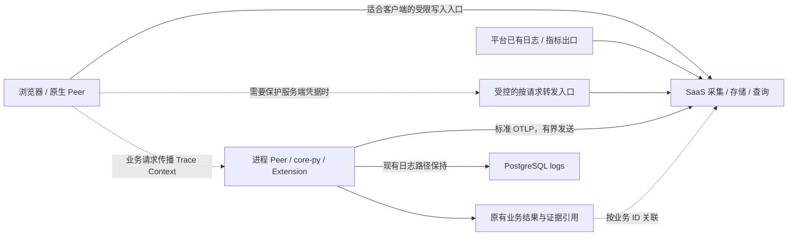

# InKCre 可观测性基建设计

状态：2026-10-03 根据 Sir 明确的 serverless、scale-to-0、SaaS、当前零新增观测服务费、vendor-agnostic 与默认关闭要求修订。标准采集、业务契约已收敛；部署拓扑已改为 SaaS 优先，目标账户准入尚未验证。本文件拥有整体设计，[共享契约](design/shared-contract.md)拥有字段和兼容形状，[工作地图](task-map.md)拥有实施顺序，[验收表](verification.md)区分实验通过与尚未实现。设计定稿不等于 Hub 契约已生效或整套基建已经交付。

显式开启后采用 **OpenTelemetry SDK/OTLP → SaaS 托管的采集、存储与查询**，不默认新增常驻 Collector、数据库或监控主机。短生命周期应用停机后，观测基建不能要求它保持在线；闲置固定费用、采集端开销和实际维护责任共同决定轻量程度。Sir 已同意 Grafana Cloud Free 作为首个可选后端；OpenObserve Cloud 需要收费，当前暂缓。选型已获同意，目标账户与实际云端接入尚未验收。PostHog 作为有原生 OTLP 三信号和 AI 分析的候选保留，但其 tracing Beta、metrics Alpha 与分析关联限制需纳入取舍。

五组件及真实旧数据库消费者实验仍提供协议和查询证据，不再证明自建方案符合 Sir 的部署目标。一个 deployment 仍属一个 owner，各 Peer 平等参与。AI 首阶段交付运行诊断及结果来源关联，原文默认关闭；长期快照由结果 owner 按明确承诺保存。

## 要回答的问题

新增遥测开启并覆盖相关 Peer 后，首阶段应能回答：一次操作在哪个 Peer 执行，等待在哪里发生，哪个模型或工具失败，最后的答案或图谱写入使用了哪些输入，以及观测系统自身是否正在丢数据。

[现状证据](inquiry.md) 已确认 Python 与浏览器都是 Job 的生产者和执行者，旧 Job UI 依赖 `job.<id>`，AI adapter 尚未保留 usage。因此方案必须覆盖对等执行、兼容迁移和 provider 边界，不能只增加 core-py HTTP middleware。

## 默认行为与按需开启

现有 PostgreSQL logging 是保留能力。新遥测开关与 `logging_backend` 独立，默认关闭；安装依赖、升级 schema、保存共享 endpoint 或放入凭据都不能自动启用。源码及 .env 模板默认 PostgreSQL，Compose 的未配置 fallback 当前为 none；实现将该 fallback 对齐为 PostgreSQL，同时保留显式 none/logtail 等原有覆盖。PG 写入的上下文门控、级别、有界队列与关闭次序继续保持，不把“默认 PG”扩大成所有日志无条件落库。

每个 Peer 用本地 `telemetry_enabled=false` 表达 opt-in。进程 Peer 从运行配置读取，浏览器从该部署连接的本地配置读取；共享 `inkcre.observability.v1` 只提供身份和目的地。首版在进程启动或浏览器连接重新初始化时生效，不承诺运行中热切换。关闭时不初始化新增 provider、processor、exporter、后台队列或自动 instrumentation，也不新增 Trace Context 注入/提取和 Job carrier 捕获；保留现有日志关联机制。启用所需配置不足则清楚报告新遥测初始化失败，不改变业务 readiness 或旧日志路径。

开启后 PG 继续记录原有日志，OTLP 只增加声明的元数据记录；不能把 PG 历史、任意日志文本或 agent_debug 内容自动转发。撤销“新查询通过后停用 PG writer”的旧计划。已有 `logs.trace_id=job.<id>` 等字段不改成 OTel Trace ID，新增标准关联在新的遥测记录里表达。Job 页面始终提供原日志，外部诊断链接是附加能力。

关闭参与的 Peer 会产生明确的诊断缺口：其新建 Job carrier 为 NULL，更新已有 Job 时保留此前 carrier；开启的执行 Peer 对有效 carrier 建 Link，对 NULL 建独立 trace。不开启的执行 Peer 正常执行且不产出新 span。关闭并重新初始化不删除历史日志或 carrier，也不把缺少 span 解释成没有执行业务；详见[共享契约](design/shared-contract.md)。

## 采集、汇聚、存储与查询

以下图示仅表示显式开启的新增路径；现有 PG 日志在两种状态下均保留。

进程 Peer 直接使用 SaaS 提供的标准出口；进程内 Extension 复用宿主 SDK。浏览器仅在有适合公开客户端的受限写入能力并通过 CORS/滥用边界验收时直连；否则使用既有认证下的按请求转发，优先复用现有平台能力。不能把服务端私密 ingest、查询或管理凭据写进静态 bundle。转发只负责必要的认证和路由，不增加自研遥测协议、持久队列或查询平台，也不能让浏览器 Job 的业务路径被迫经过 core-py。

应用使用标准 SDK、context manager、propagator、batch processor 和 exporter；我们只补 HTTP/Peer、Job/Cron、AI/Tool 及结果这些共用业务边界。基础模式导出的是允许的元数据记录：固定操作名/事件名、路由模板、状态、耗时、受控 ID、真实 usage 与异常类型。字段许可同时限制值的来源，不能把任意用户字符串装进一个获准字段。浏览器在共用 Peer/DBAPIClient 调用边界接入，不全局劫持全部 fetch。

不默认启用全量 FastAPI/HTTPX/SQLAlchemy 自动埋点。仅当固定版本配置或 hooks 能约束最终完成记录的 span 名称、属性、events 和 status 时，才逐个准入。最小公共 span 入口统一关闭 `record_exception` 与 `set_status_on_exception`，失败时显式设 ERROR 与异常类型；仅关前者仍可能把异常文本写入 status description。数据库先记录业务调用耗时和连接池指标，不自动导出 SQL statement/参数。无需为保留全面自动埋点构造通用 Span 重写层。[固定版本 SDK 行为](https://github.com/open-telemetry/opentelemetry-python/blob/v1.45.0/opentelemetry-api/src/opentelemetry/trace/__init__.py)

新增 OTLP logging bridge 只接专用结构化事件 logger，body 为固定事件名；不扩大原有 root、应用/第三方 logger 的出口范围，stdout 与配置的 PG/Logtail 路径继续保持。SDK 的非法 tracestate 警告因此不进入远端基础日志。Resource 同样明确列取，不自动上传命令行或任意运行环境。既有 PG/Logtail writer 可能继续包含动态内容；新增 OTLP 的元数据承诺只覆盖新出口，不要求用户再次开启旧日志，也不能据此声称整个部署没有原文副本。

SDK 使用现有有界 batch、超时和有限重试。常驻进程在正常关闭时有界 flush；短生命周期任务在平台保证的执行窗口结束前 flush，测量新增延迟和计费时间，不能假定 HTTP 响应后仍能继续发送。冻结、崩溃、浏览器关闭可能丢失尾部数据，重试也可能重复；两者都不能改变业务结果。遥测不可用不阻止启动或 readyz，保留本地诊断。

应用指标优先 OTLP push；不为 scrape 唤醒已缩至零的实例。实例退出后的无数据不能当成 usage=0 或故障。全局 pending Job 等状态由既有持久读源或实际运行的调度责任采集，不为面板单独增加常驻轮询器。平台托管 PG/PostgREST 的可用出口按实际能力接入，不自称采到了不可见的数据库内部行为。

只有已证明需要宿主采集、协议转换、多目标路由或额外缓冲时才增加 Collector；复用其原生接收器、认证、重试和队列，不自行实现。跨重启积压需求同时意味着持久存储和运行成本，需有具体收益才启用。[Collector 可靠性边界](https://opentelemetry.io/docs/collector/resiliency/)

### SaaS 选择与运行责任

| 部署选择 | 适用性与准入重点 |
| --- | --- |
| Grafana Cloud Free | Sir 已同意；按需开启时使用，并验证实际 Free 计划；托管三信号、非限时免费且无需信用卡，不部署 Tempo/Loki/Prometheus，不开 Pro 或付费附加项 |
| Cloudflare 原生观测 | 覆盖其平台 Unit，内容/关联准入后可导出 logs/traces 到统一后端；AI Gateway 按模型代理需求单独评估，Analytics Engine 不作唯一 Trace 库 |
| OpenObserve Cloud | 因当前零费用约束暂缓；既有缺失值实验及兼容办法仍有效，不把免费试用当长期方案 |
| PostHog Cloud | 原生 OTLP 三信号和 AI 分析均存在；tracing Beta、metrics Alpha，普通 Trace 与 AI 分析尚非统一查询/UI。当前不作为唯一基建首选 |

[本轮判别报告](experiments/sentinel-saas-20261003.md)拥有当前官方费用、成熟度、入口差异与 `-1` 实验。正式采用前用一个实际 Free 账户确认限额、无付费依赖，并验证必要的因果查询、unknown/zero/partial、counter/histogram、浏览器写入边界、样本导出、配额和关闭。没有账户实验就不能把本地 OpenObserve 或自建 Grafana 的结果标成 SaaS 验收通过。

部署 owner 管理 SaaS 项目、区域、写入/读取角色、额度、保留、导出和删除。当前新增观测服务费为零，不能自动升级计划、启用收费扩展或依赖限时试用；额度不足时削减可选遥测并呈现丢失。采集费用包含应用 flush/网络成本；存储/查询费用按目标计划计量。保留期取供应商实际可用设置，不沿用自建 7/30 天假设。为额度耗尽和丢弃提供可见状态；告警和查询不得通过不断访问业务服务破坏 scale-to-0。首版不自建供应商账单服务或控制面。

不交付默认自建五组件配方。已有隔离配方保留为协议实验及确有自托管需求时的备选；其 2 CPU/4 GiB、608 MiB 快照与约 8 分钟 Grafana 冷启动不是生产预算依据。未来选择自建时另验冷备/恢复、磁盘回收和认证；托管方案则验配置重建、受支持导出/恢复、保留和删除，不能承诺访问或恢复供应商内部卷。

“避免锁定”是实现约束：业务采集不引入 Grafana 专有 SDK、项目或 datasource ID，不按 vendor 分支；身份/carrier/schema 不包含供应商标识。部署配置拥有 OTLP 端点与认证，查询/面板及诊断链接的后端语法归消费侧。标准 SDK、独立业务 ID、明确字段映射与必要记录导出构成更换后端的基础。切换可改 SDK 出口或按需要短期双发，不把一直运行 Collector 作为可替换性的前提。SaaS 账户、查询语言、面板和历史数据仍有迁移成本；优先让旧保留期自然结束，只有实际历史需求才做迁移。后端不必原样保留每个 OTLP 字段，但必要因果 ID、unknown/zero 与聚合语义必须能正确消费；历史 Link flags 或不用的自动推导字段不是单独否决项。

## 多 Peer 关联契约

以下关联行为适用于开启的 Peer；关闭或未接入 Peer 允许造成诊断缺口但必须保持业务正确。[共享契约候选](design/shared-contract.md)拥有当前字段、身份来源和旧新消费者兼容提案，尚未发布到 Hub。

使用 OTel Resource 区分 deployment、service、version、environment、Peer 与进程实例。部署标识在同一 owner 的 Peer 间一致；Peer 标识复用已有身份；进程实例随启动变化。尚未注册的启动日志不伪造 Peer ID，浏览器身份由其现有运行契约提供。业务 ID 作为属性，不能兼任 Trace ID。[OTel Context Propagation](https://opentelemetry.io/docs/concepts/context-propagation/)

| 路径 | 提议的关联方式与约束 |
| --- | --- |
| 同步 Peer HTTP 委派 | 标准 `traceparent`/`tracestate` 注入和提取；调用端、候选选择、远端执行分别成 span。记录能力 ID、目标 Peer、执行结果；不改变现有“结果未知不能泛化重放”的规则 |
| HTTP → 持久 Job → 另一 Peer 执行 | 提交时保存可选、受限的 Trace Context；执行创建独立 trace 并用 Span Link 连接提交 span，同时记录 `job.id`。ContextVar 不能跨数据库和进程；旧 Job 没有上下文时独立起 trace |
| Cron / 周期回调 | 每次发生独立 span；Cron ID、发生时刻和创建的 Job ID 关联。不能把所有周期调用挤进一个永久 Trace |
| 浏览器直连 PostgREST/本地执行 | 在操作和 HTTP 客户端边界采集；Job 的提交上下文要覆盖直接写入路径。PostgREST 服务端/SQL 层能否贯通需查所用版本，客户端 span 不冒充数据库服务端 span |
| 并发工具/批处理 | 用 span 父子或 links 与 ToolCall ID 表达依赖；不按日志到达顺序推断执行顺序，不用跨机时间戳强行排序因果 |

任务等待时间由已有持久时间字段与数据库时钟解释，执行耗时使用本地单调时钟。大量不同 job/thread/block/trace ID 只进入日志和 Trace 属性，不进入无界指标标签。能力、路由模板、状态、受控模型集合可用于聚合；模型名称也要控制动态值数量。[Prometheus 对标签基数的说明](https://prometheus.io/docs/practices/instrumentation/)

Job 的可选提交上下文涉及共享数据库契约，是必要的待提议 Hub 增量。旧 Python/TS 模型能忽略额外列，但 core-py 的 exact-head readiness 仍须独立处理；模型可读不等于跨版本运行获准。不得把通用遥测元数据塞入任意 Job 的业务 parameters/state 来绕过契约，也不得将日志写入成功作为 Job claim/close 的条件。两列、容量、部署配置键与协调升级顺序已在共享契约定稿；真实数据库已证明旧消费者默认 NULL 且 claim/close 保留 carrier，模拟新 head 也证实旧 readiness 拒绝。正式 migration 与真实混合 Peer 验收仍未执行。

## AI O11y 与证据追溯

基础 Trace 应呈现 `Agent turn → model call → tool call → retrieval/resolver/Peer call → result`。直接模型调用、embedding、Organization 多模态解释也必须经过共同 AI 执行边界，不能只覆盖 Agent Query。复用已有 thread、turn、call、ToolCall、Job 和实体引用。

| 层次 | 记录内容 | 能承诺什么 |
| --- | --- | --- |
| 运行诊断 | provider/model、操作、耗时、流式首块延迟（适用时）、结束原因、错误类型、真实 usage、工具调用关系 | 在已采集并保留的范围内解释运行性能和失败 |
| 结果来源关联 | 检索候选、实际读取的实体、最终引用或写入结果分开记录；关联 prompt/config 版本或指纹 | 看见输入、步骤与结果的关系；记录的关联不能证明模型确实依据某段内容推理，更不能直接证明答案正确 |
| 长期证据或回放材料 | 当时实际使用的内容快照、版本、必要参数、工具结果和结果关联；有单独保留与删除契约 | 可审阅历史输入；外部模型、工具与世界状态变化意味着不能保证确定性重放 |

第一层使用 OTel GenAI 语义约定；固定独立仓库修订 `e07f4ebacb08f56db8c4c882d117720333fbca04`，集中映射并重验升级，不跟随 Development 字段漂移。[固定 GenAI 规范](https://github.com/open-telemetry/semantic-conventions-genai/blob/e07f4ebacb08f56db8c4c882d117720333fbca04/docs/gen-ai/README.md)。模型输入输出等内容为单独 opt-in；基础性能元数据不依赖开启原始内容采集。[GenAI span 规范](https://github.com/open-telemetry/semantic-conventions-genai/blob/e07f4ebacb08f56db8c4c882d117720333fbca04/docs/gen-ai/gen-ai-spans.md)

用量在 adapter 收到 provider response/chunk 时保留，覆盖 embedding 和流式末尾 usage；缺失是 unknown，而不是零。区分缓存和其它计费维度，以供应商返回为准。成本由用量、明确的价格版本与币种估算，实际账单仍由 provider 结算；采样 Trace 的费用和不是全量账本，应用可在采样前累计用量指标，但遥测丢失仍会影响完整性。无需仅为采集 usage 就重写所有调用方的业务结果类型；先评估 adapter 采集是否已满足查询需求。

源端标准 usage 字段缺失时省略，不向 token counter/histogram 写入 `-1`。目标后端可以使用 sentinel 映射，但查询、导出和面板必须先还原 unknown，不能直接求和。首选方案是允许最少的逐字段来源元数据：input/output 为 provider 或 unavailable，cost 为 estimate 或 unavailable；成本估算继续附价格版本和币种。这不重复数值，也不另建业务 authority。部分 usage 缺失时完整 total 仍未知；仅对已知部分求和并展示缺失数量。内置 AI 面板若把补零/部分和当成完整值，就使用版本化的来源感知查询；不能给误导面板贴上“可信成本”标签。

长期 traceability 不能依赖会采样和过期的 Trace。若要求每个答案或 AI 图谱变更以后都能解释，应由相应业务结果 owner 持久化最小证据，遥测只关联它；优先扩展已有结果/引用契约，而不是建立通用 Agent 执行库。只存 Block ID 或行更新时间不足以恢复当时的外部 Storage 字节；hash 也只能比较，不能还原。需要历史内容时必须保存当时的受控快照并承认其存储成本。

首个试点仅对受控合成/经授权的元数据路径配置全采样，才能检查完整性。扩大后再根据量采用采样；头部丢弃的 Trace 无法靠尾部采样补回，长时间 Job 的 Span Links 也不意味着后端会一起保留。错误/慢请求的保留规则需有实际容量验证。产品证据不受通用 Trace 采样决定。

专项 AI UI 作为后续消费端按需求选择，不成为采集 SDK 或业务结果的权威。若要 prompt 管理、评测数据集、人评等工作流，再验证 Langfuse 或其它工具的收益；其当前自托管包含 Web、Worker、PostgreSQL、ClickHouse、Redis/Valkey 和 Blob Storage，不应因名称是“AI tracing”就默认当作轻量附属件。[Langfuse 自托管架构](https://langfuse.com/self-hosting)

## 数据边界与分析入口

当前信任边界以共享 security model 为准。需要处理的具体风险是：外部内容或异常消息携带敏感值，被采集后发给部署以外的观测运营者；未经授权的读者再从日志/Trace 取走凭据、知识内容或完整 prompt。资产是部署内容和凭据，跨越的是部署到遥测存储及其读者的边界。这里是新设计必须限定的数据出口，并非宣称现有实现存在已证实漏洞。

新增 OTLP 基础模式只记录明确列出的元数据和非敏感关联 ID；默认关闭新遥测时不导出这些记录。Authorization、Cookie、provider config、签名 URL、SQL 参数、任意 request/response body 不自动采集；异常消息、属性和事件也遵循内容策略，不能只过滤 HTTP headers。来源和字段策略在 Peer 第一次发送前生效；若引入 Collector，可再做一次筛选；不使用通用正则脱敏来宣称原文不会外流。G2 在正常、异常、流式结束、SDK 警告路径直接检查首次 OTLP 出口的 canary，而不只看后端清洗后的结果。Trace Context 不提供认证，浏览器上报的 Peer/resource 属性也不作为权限证明，传播目标限定在已配置的部署边界。

按部署分开摄取和查询权限，采集凭据不给读取/管理权限。默认不采集浏览器 session replay。内容允许时再明确保存目的、可访问者、大小限制、截断标记、保留和删除；外部 blob 引用不包含公开长期下载链接。删除业务材料不会天然删除观测副本，这一点必须进入启用内容的契约。

首批分析面板围绕问题建立：

- **部署与 Peer**：运行版本、lease/readiness、请求错误率/延迟、资源饱和、数据库连接/查询压力；全局 pending Jobs 用单一读源统计，不能把各 Peer 对同一队列的观测重复相加。
- **业务运行**：按 Job ID 找提交、等待、执行和关联 Trace；按能力看委派、未执行与结果未知；按 Source/Sink 看成功、失败、耗时和已存在的业务进展。
- **AI**：模型/操作的延迟、失败、Token 与估算成本，单次 turn 的并行工具和检索路径，以及结果到证据引用的跳转。
- **观测管线**：SDK 与可选 Collector 的导出失败、队列占用和丢弃，SaaS 用量/限额、保留和查询状态；后端完全失效另有外部探活，不依赖失效组件给自己发告警。

常用查询与仪表盘随部署配置版本化。业务 UI 保留 Job 日志能力，可增加按 Job/Trace 的诊断跳转；不在 InKCre 里重建完整日志搜索产品。告警先覆盖可采取行动的失败、积压和观测丢失；阈值依照试点基线及运行目标确定。

## 实现归属与实施输入

独立区分四个 owner：Hub 拥有跨 Unit 语义；各 Peer/AI/结果 Unit 拥有实现；部署 owner 拥有 SaaS 项目、访问和数据生命周期；W3C、OTel 与供应商拥有协议和外部服务机制。core-py 的 `docs/40-deployment/observability.md` 拟拥有部署接入与运维步骤，各 Peer 交付自己的 SDK 生命周期和连接配置，不新增专门平台仓库。若浏览器确需转发，先验证供应商能力与现有平台缺口，再由实际运行入口 owner 交付；不能因为 core-py 分发文档就把所有观测流量汇聚到 core-py。

| 责任表面 | 实施时的具体输入 |
| --- | --- |
| core-py `libs/obsrv`、bootstrap/middleware | 本地 opt-in 门控、标准 SDK 生命周期、专用事件 logger 与受控 span；PG 日志保持，关闭有界、后端不可达仍 ready |
| Python Job/Cron、Peer 能力调用 | 共用提交事务写 carrier，claim 成功后 Link；调用选择/执行状态不影响既有重放规则 |
| client-web 共用 core 包的 Job/Peer/DBAPIClient | SDK context 显式传递到异步边界；浏览器实际 context/OTLP/CORS 验收；Web app 的 Job 页接历史与新诊断跳转 |
| AI dialects、Agent thread/tool、Organization/embedding | provider 回包处 usage 与结束原因；区分候选、实际读取、最终引用/写入；不把 debug 原文桥接为基础日志 |
| 主机/PostgreSQL/PostgREST | 用现成接收器、exporter 或受控平台出口采集进程、连接池、存储与服务指标；SQL/任意平台日志不默认进入基础模式 |
| 独立客户端、官方 Registry | 按各自运行环境接入，覆盖状态和具体入口由工作地图逐项管理，不能把目录或共用技术栈当成已覆盖 |

Resource 最小集合是 service 名称/版本、运行实例、deployment、已知 Peer、environment；不采集凭据派生标签。日志/Trace 另带 job/thread/turn/tool-call/实体 ID；指标维度限服务、受控操作/能力/路由/模型、结果和 error type，未知动态名称归并受控类别。Peer lease/pending Jobs 由单一读源统计，避免各 Peer 重复累计同一队列。按实例区分 SDK counter reset，聚合用 rate/increase；unknown usage 不添加零样本，另计有界 usage-missing 事件数。实际字段名以 SDK semconv 和共享契约投影为准，不建立第二套通用事件框架。

基础 AI traceability 在保留期内连接 Job、模型/工具、实际读取与已有最终引用；Agent Query 的 answer/references 继续留在原业务结果，Trace 不能冒充持久结果。若开启历史内容复核，扩展对应结果的版本化 evidence 引用：记录采集时刻、来源实体/版本或指纹、所用配置版本、受控快照引用及完整性状态；快照由既有 Storage/结果 owner 管理并随授权/保留删除，不建通用 Agent 执行库。此增强能力必须先确定 Q1 的保存与删除承诺，再制作该结果 owner 的 schema diff；当前没有承诺永久复现所有答案。

[工作地图](task-map.md)给出 Hub→Spoke→schema/各 Peer→G2→G3 的具体交付顺序和回退约束。后续只验证首选免费 SaaS 的必要准入，失败后才比较能满足条件的免费备选；不做无限产品比较。目标账户能力、实际预算、长期内容承诺和尚未执行的验收继续明确保留。
