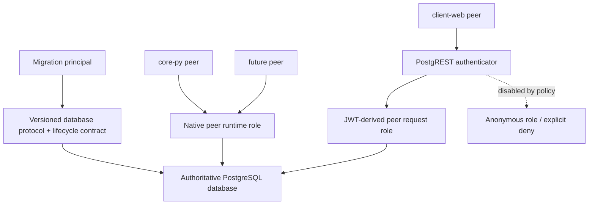

# Peer Database Runtime Contract Task Packet

## MVT Core

- Objective & Hypothesis: define and deliver a versioned, provider-neutral database runtime
  contract that every InKCre node can consume without copying SQL or inferring initialization
  order. The working hypothesis is that `core-py` should remain the current schema, migration,
  and database-contract authority without becoming a privileged central backend: native
  database clients and PostgREST clients are peer transports over one explicit database
  protocol surface.
- Guardrails Touched: all participating units are peer nodes rather than frontend/backend
  tiers; production business data must be preserved and is never seed; database roles and
  migrations may not depend on Neon-specific owners; login credentials and JWT secrets are
  runtime inputs; development reset must be fail-closed outside disposable development
  databases; `docs/_shared/**` remains read-only from this Spoke; the unrelated
  `codex/pyrefly-gate` work and untracked `portless.json` remain outside this packet.
- Verification: prove a fresh standard PostgreSQL/pgvector database can be initialized through
  one ordered contract; prove every primitive is idempotent; prove native and PostgREST peers
  observe the same admitted data semantics; validate role membership, ACLs, default ACLs,
  migration head, system catalogs, and development seed through stable JSON and exit codes;
  exercise valid/invalid JWT requests, explicit anonymous policy, safe reset, deterministic
  baseline recovery, and a digest-pinned OCI artifact; preserve production through independent
  backup/restore and schema-equivalence evidence before any lineage hard cut; restore the
  peer-database contract to the canonical SVC 10.0.1 Hub truth consumed by both Spokes; prove
  local Docker commands can target the same explicit remote runtime instance as client-web
  without relying on coincidental ports, Compose project names, or implicit SSH state.

## Classification And Active Mode

- Constraint: introduce a cross-unit database protocol and lifecycle contract.
- Reality: local, staging, and production currently expose different database access
  topologies, while the existing migration grants and JWT validation do not constitute a
  portable contract.
- Artifact: this packet, the later Hub Product TDD contract, lifecycle commands, database
  protocol surface, readiness schema, and integration proof.
- Active mode: Solidify complete. Executions 01–09 remain operationally complete. The
  2026-07-26 closure audit reopened Execution 00 after disproving its durable-authority exit
  condition; Execution 10 restored canonical authority, published both Spoke changes, and
  proved the core-owned remote runtime plus client-web attachment locally, in CI, and through
  production delivery.

## Relationship To Earlier DX Work

- `tasks/developer-experience-engineering/` is closed and remains historical evidence.
- This packet is a successor task with a narrower but deeper boundary: database protocol,
  identity, lifecycle, and consumption by peer nodes.
- Stable cross-unit conclusions must eventually be promoted source-first to the `InKCre/docs`
  Hub Product TDD; provider mechanics and core-py internals remain local.

## Current Understanding

### Peer topology

- `core-py`, `client-web`, and future units are peer nodes. There is no durable
  frontend/backend hierarchy.
- Multiple nodes directly operate on the authoritative database:
  - Python/runtime nodes may use a native PostgreSQL driver;
  - browser nodes require an HTTP database transport such as PostgREST.
- Peer product status does not imply identical connection credentials or database privileges.
  Migration authority, native runtime authority, PostgREST connection authority, JWT-derived
  request authority, and anonymous authority are distinct security principals.
- A dedicated database protocol schema, if selected, is therefore a shared peer contract
  rather than a client-web adapter or a backend-owned façade.

### Observed environment topology

- Development `docker-compose.yml` contains PostgreSQL, migration, and core application
  services but no PostgREST service.
- Legacy staging has a separate Heroku app named `inkcre-pgrst`:
  - it connects to the same Neon database host as `inkcre-core-staging`;
  - it runs PostgREST `10.0.0`;
  - it exposes the `public` schema;
  - it connects as the provider-specific `neondb_owner` role;
  - it configures `anonymous` as the anonymous role;
  - it has a JWT secret matching staging core-py and no configured JWT audience;
  - after its Eco dyno wakes, it connects successfully and listens; unauthenticated root and
    `clients` requests return `401`, while a short-lived `authenticated` JWT can read
    `clients` with HTTP `200`.
- Canonical production has no PostgREST deployment:
  - `inkcre-core-production` has only the core-py `web` process;
  - it has no `PGRST_*` configuration;
  - its Neon database host differs from the legacy staging/PostgREST host;
  - its JWT secret does not match `inkcre-pgrst`.
- The old staging PostgREST is therefore an unversioned legacy runtime, not a production or
  cross-environment contract.

### Branch, environment, and pipeline facts

- Git `develop` is already an ancestor of `main` and has no unique commits; the only open PR
  targets `main`.
- Remote `staging` is a stale 2025 branch unrelated to the current delivery line.
- The current preview workflows trigger for same-repository pull requests without restricting
  the base branch. CI explicitly admits both `develop` and `main`.
- Heroku already has exactly one relevant pipeline, `inkcre-core`, containing:
  - `inkcre-core-production` in the production stage;
  - legacy `inkcre-core-staging` in the staging stage;
  - current PR apps such as `inkcre-core-pr-31` in the review stage.
- `inkcre-pgrst` is not coupled to that pipeline.
- A Heroku pipeline is a grouping and promotion surface, not one running application. One
  pipeline can contain one durable production environment and multiple ephemeral review apps
  without retaining a staging app.
- A single Heroku app cannot expose independent FastAPI and PostgREST public web processes
  through ordinary process types. Achieving one physical app would require a composite
  container and reverse proxy that supervise both processes, coupling their lifecycle,
  scaling, health, and logs.

### Managed Data API candidate

- Neon Data API is PostgREST-compatible and configured per branch/database, which would
  otherwise fit branch-scoped previews well.
- Its current authentication contract requires one JWKS-backed authentication provider and
  is oriented around verified user identity plus PostgreSQL RLS.
- It does not directly implement the confirmed browser-held HS256 shared-secret and PostgREST
  role-switch contract. Adopting it would therefore require a separate identity/JWT
  architecture decision rather than a transparent runtime substitution.

### Existing contract gaps

- The initial migration creates a cluster-global `authenticated` role and grants it to a
  hard-coded `postgres` role; the standalone grant script instead names `neondb_owner`.
- Live staging and production contain an unsafe `anonymous` LOGIN role with `CREATEDB`,
  `CREATEROLE`, and `neon_superuser` membership. Anonymous denial is currently accidental
  role-switch failure rather than a valid least-privilege contract.
- No portable `authenticator` provisioning, fail-closed anonymous policy, default privilege
  policy, or machine-readable ACL verification exists.
- Current table grants do not cover all writes performed by client-web.
- The CLI readiness probe checks connectivity and Alembic head only.
- System catalog reconciliation and client registration are coupled to FastAPI lifespan,
  extension startup, and scheduler startup; default `CLIENT_ID` is random.
- Client-web and FastAPI disagree on JWT audience, and neither side currently implements the
  full proposed claim contract.
- PostgREST exposes persistence tables from `public`, making physical schema changes into
  cross-repository API changes.

## Working Model

## Candidate Contract Shape

- One primary orchestration command prevents consumers from guessing order:
  `db init --profile development|runtime`.
- Independently callable, idempotent primitives remain available:
  `migrate`, `provision-roles`, `reconcile-builtins`, `seed-dev`, `ready`, and
  `reset-dev`.
- Artifact-owned system catalogs are reconciled independently from development-only seed.
- Readiness has versioned JSON and at least `runtime` and `development` profiles.
- The core-py OCI image is the executable contract and carries source revision metadata;
  consumers pin it by digest.
- PostgREST remains a separately pinned upstream image. It is not baked into core-py.
- A shared protocol schema is preferred over permanently exposing persistence tables, but its
  exact object and write surface remains an Explore decision.

## Solidified Contract Decisions

1. The shared database protocol schema is `inkcre`. It is the authoritative relation/function
   surface operated by every peer, not a frontend-specific façade. PostgreSQL administration
   and Alembic bookkeeping remain outside that schema.
2. `authenticated` is the shared NOLOGIN capability role. Every native deployment gets its
   own login principal with membership in that role; PostgREST uses a distinct unprivileged
   `authenticator` login that may switch only to `authenticated`.
3. JWT authority is `HS256`, `role=authenticated`, `iss=inkcre-client`,
   `aud=inkcre-api`, required `iat` and `exp`, with a maximum 24-hour lifetime.
4. PostgREST is a separately pinned process/app in the same logical production or review
   environment and Heroku pipeline. FastAPI and PostgREST are not supervised in one dyno.
5. Migration history will receive a controlled hard-cut portable baseline. Production rows
   are preserved through checkpoint/archive/restore evidence and a schema-aware lineage
   transition; stamping alone is not accepted as schema proof.

## User-Confirmed Decisions

- One database is an intentionally shared trusted domain for its authenticated peers.
- Every authenticated peer may operate the complete admitted database protocol surface;
  per-user or per-node row isolation is not required.
- Canonical client-web should join the canonical production database by default.
- Canonical production therefore requires an authenticated HTTP database transport; the
  legacy staging PostgREST is not an acceptable production substitute.
- Minimize durable environment and pipeline count. A persistent staging environment is not a
  requirement merely because a `develop` branch exists.
- Every persistent and review Heroku web formation must use an Eco dyno. A later change to
  dyno class requires an explicit cost/capacity decision rather than provider default drift.

## Recommended Environment Policy

- Use trunk-based delivery:
  - `main` is the only durable integration and production branch;
  - same-repository PRs targeting `main` receive isolated review environments;
  - successful `main` delivery updates production.
- Retire the `develop` and `staging` Git branches after branch-protection and consumer checks.
- Retire `inkcre-core-staging` and the legacy `inkcre-pgrst` only after confirming no browser,
  extension, DNS, webhook, or recovery consumer still addresses them.
- Keep one logical Heroku pipeline, renamed from `inkcre-core` to `inkcre` only if the broader
  peer-runtime scope justifies the naming change.
- The minimum logical topology is:
  - one durable production environment;
  - zero durable staging environments;
  - one isolated review environment per eligible PR.
- Review identity must include repository plus PR number before client-web joins the shared
  automation; bare `preview/pr-<number>` is not globally collision-safe across peer repos.
- A preview database should be created from a data-free `preview-base` derived from canonical
  production and then migrated by the exact PR artifact. It should not inherit production rows
  and does not require a persistent `develop` database.

## Packet Artifacts

- [`audit.md`](audit.md): current consumer, control-plane, database-role, and retirement
  evidence.
- [`roadmap.md`](roadmap.md): complete execution scope, phase gates, and client-web DX
  outcomes.

## Negotiation Triggers

- Pause if peer-node equality is translated into one over-privileged shared credential without
  confirming the trust domain.
- Pause if a proposed PostgREST surface exposes internal tables, functions, or future objects
  by default.
- Pause before Hub edits, production database lineage changes, role/password rotation,
  PostgREST deployment, or staging retirement.
- Return to Diagnose if production/staging consumers or database ownership cannot be resolved
  without reading live state.

## Current Execution Slice

- Executions 00–06 established the shared contract, portable role/ACL baseline, deterministic
  lifecycle CLI, standard PostgreSQL/PostgREST acceptance harness, digest-pinned OCI runtime,
  and canonical production PostgREST. Production data survived the hard cut with manifest
  evidence and remains at migration head `d9f4e2a1b7c3`.
- Execution 07 landed in client-web PR #18. `pnpm dev`, `pnpm run doctor`, deterministic
  database lifecycle commands, generated relation types, canonical production discovery,
  legacy endpoint detection, JWT convergence, and full browser E2E now consume the pinned
  runtime contract rather than SQL or inferred startup order.
- Execution 08 uses `preview/core-py/pr-N` plus `inkcre-core-py-pr-N`, permits only trusted PRs
  targeting `main`, and proved exact creation and cleanup in real PRs #37 and #38. Production
  deploy run `30091595400` is green. Every Heroku web formation is Eco.
- Execution 09 removed the Heroku pipeline's legacy GitHub repository link and all-events
  webhook, stale GitHub environments and OpenAPI registration, repository-level legacy
  secrets, core Git `develop`/`staging`, client-web Git `develop` plus its obsolete Heroku
  branch, Neon `develop`, and the `inkcre-core-staging`/`inkcre-pgrst` apps. Historical client
  branches remain reachable through archive tags.
- Neon staging storage is retained only as
  `archive/staging-lineage-20250824` without a compute endpoint: Neon forbids deleting an
  ancestor of the retained pre-cutover checkpoint and production lineage. No active address
  or credential targets it.
- The `inkcre-core` pipeline now contains exactly `inkcre-core-production` and
  `inkcre-postgrest-production`, both in production with one Eco web dyno. Core `/livez` and
  `/readyz` return 200; readiness reports `peer-database-runtime-v1` at
  `d9f4e2a1b7c3`; unauthenticated PostgREST returns 401.
- client-web `main` requires PRs, linear history, and the three green checks `Workspace
  contract`, `Peer database browser E2E`, and `Dependency security review`; force pushes and
  deletion are disabled. Main dependency audit has zero critical/high vulnerabilities.
- Cloudflare Pages code is ready but provider activation remains optional and externally
  blocked by Cloudflare account verification. PR #19 makes unconfigured provider jobs skip
  explicitly; once the project variable exists, deployment failures remain blocking.
- The packet is closed after Execution 10. `portless.json`, unrelated branches, client-web
  Pages delivery, and client-web's in-progress application work remain outside its scope.

## 2026-07-26 Closure Reassessment

- Runtime truth remains healthy:
  - core-py `main` repository checks, OCI publication, and production delivery are green;
  - canonical core and PostgREST production apps remain Eco and ready;
  - live readiness reports contract `peer-database-runtime-v1` and migration head
    `d9f4e2a1b7c3`;
  - no active staging/develop runtime has reappeared.
- The former Execution 00 exit proof is false:
  - core-py consumes Hub commit `f648612`, published only on the SVC v9.8 alignment branch;
  - client-web consumes Hub commit `ad464fd`, published on the SVC 10.0.1 adoption branch;
  - Hub `main` is `179336c` and does not contain the peer-database runtime contract;
  - the SVC 10.0.1 projection omitted the dedicated contract and its topology/authority
    references.
- Cloudflare Pages is no longer blocked or owned by this packet. client-web records a proven
  production deployment, Direct Upload project, and `app.inkcre.dev`; its continuing Pages
  work is independent of core-py's remaining work.
- This machine deliberately has no local Docker daemon. client-web already proves Docker
  execution through SSH host `wsl.win-ws.localhost`; core-py should consume the same
  provider-neutral capability.
- Remote Docker sharing must mean one explicit runtime instance, not merely the same daemon.
  The selected instance identity, Compose project, network, database endpoint, contract
  revision, and owner repository must be machine-readable and checked before either Spoke
  reuses it.

## Execution 10 Scope And Exclusions

- Promote the peer database/JWT/environment contract into the canonical SVC 10.0.1 Hub
  structure and publish the Hub source commit first.
- Bump core-py and client-web to that same published Hub commit in isolated Spoke commits,
  without disturbing client-web's current application work.
- Adopt SVC 10.0.1 in core-py's local dispatcher and shared-doc workflow.
- Reuse client-web's SSH Docker transport and instance-provenance model in core-py; keep local
  Docker as the portable default and allow a validated SSH alias as a machine-local override.
- Prove both Spokes resolve the same database instance through stable identity and readiness
  evidence before sharing it.
- Do not add a cross-Spoke shared-ref or contract-freshness CI gate. Sir explicitly rejected
  that mechanism; alignment is part of this bounded execution, not a new permanent check.
- Do not modify client-web Pages delivery, current application work, production data, Heroku
  topology, Neon topology, or the unrelated `portless.json`.

## Execution 10 Verification Evidence

- Hub PR 4 published the restored SVC 10.0.1 peer-runtime authority on canonical commit
  `a0ba0d415dbda735ce7da06145354f49c7bedecd`; core-py and client-web now consume that exact
  commit. No cross-Spoke freshness gate was added.
- core-py resolves this worktree to database runtime instance `b0a97f7ca6abfdf7`, Compose
  project `inkcre-core-py-b0a97f7ca6abfdf7`, and Docker daemon
  `0e5fa4b3-f25e-4af9-bdcb-b4387a42281e` through the ignored SSH provider. The committed
  provider remains portable local Docker.
- The owner descriptor publishes contract `peer-database-runtime-v1`, migration head
  `d9f4e2a1b7c3`, source fingerprint, loopback endpoints, and bounded tunnel identity.
  Consecutive ensure operations reuse and converge the same instance.
- A real guarded reset returned the exact same deterministic baseline fingerprint before and
  after reset:
  `8fd29afe98602906a881ec2468556c911dd5b4fa7a14eb86be35978b34259e22`.
- client-web keeps its own SVC attachment identity `4ac9df364b54706e` but reports the same
  database runtime instance, owner, Compose project, daemon, contract, head, and readiness.
  It refuses shared reset and teardown; core readiness remains healthy after its stop command.
- client-web's browser database E2E automatically selected an independently owned SSH runtime,
  passed authenticated read/write and missing/wrong-credential rejection, and removed that
  temporary Compose project. The core-py project remained running and ready.
- core-py `pdm run check` passes with 151 tests and zero Pyrefly diagnostics. client-web
  `pnpm check` and `pnpm test:e2e:web` pass; its only host-level warning is Node 26 versus the
  repository's pinned Node 22.22.3.
- core-py PR 41 and client-web PR 26 were rebase-merged without collapsing the shared-ref and
  Spoke-local commit boundary. Their canonical main revisions are respectively `0d5db0e` and
  `cd4a6af`.
- core-py main checks `30197684807`, runtime publication `30197734657`, and production
  delivery `30197734650` passed. Both production apps run one Eco web dyno; live core
  readiness returns HTTP 200 at contract `peer-database-runtime-v1` and head
  `d9f4e2a1b7c3`, while anonymous PostgREST remains denied with HTTP 401.
- Closing PR 41 removed the exact Heroku review app and Neon preview branch in successful
  runs `30197684918` and `30197684873`. The active local descriptor now records exact core-py
  main revision `0d5db0e` and client-web remains healthy against that same runtime instance.

## Post-Closure Diagnostic Boundary

The durable shared-runtime troubleshooting boundary now lives in
[`docs/40-deployment/development-environment.md`](../../docs/40-deployment/development-environment.md#shared-runtime-boundary-diagnostics).
It records that network/database endpoint identity is currently derived rather than a
first-class profile field, external attachment proves contract compatibility rather than
exact artifact equality, and reset rejection lacks a dedicated external-peer negative test.
These are future diagnostic and hardening anchors; they do not reopen Execution 10.
